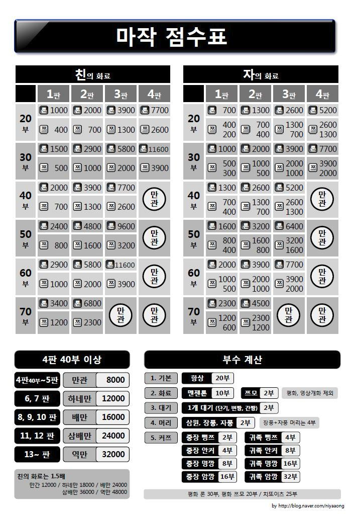
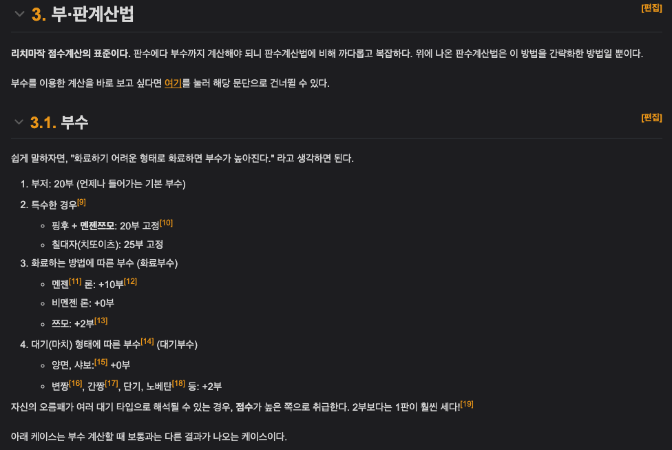
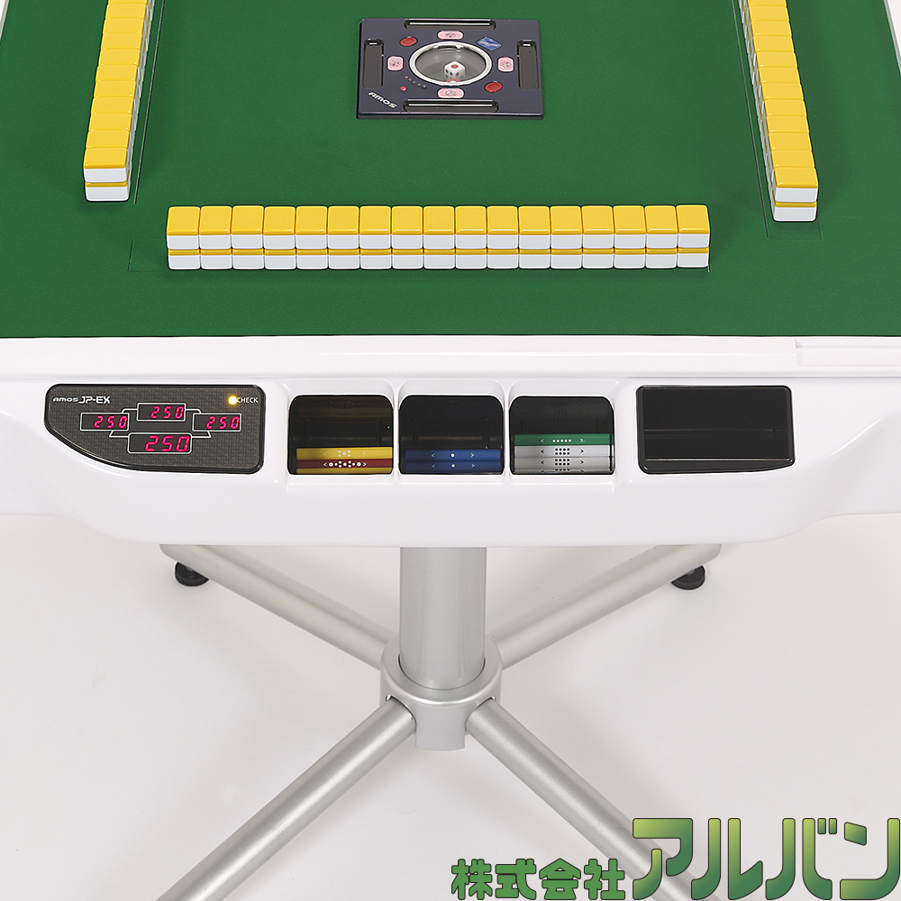

오랜만에 개인 사이드 프로젝트를 다시 시작하며 마음을 다잡아 보기로 했다.  
내가 선정한 주제는 바로 마작으로 10월부터 친구의 권유로 마작에 입문하여 여러 사람들과 함께 하며 번아웃을 이겨내게 해준 최고의 테이블 게임이다.  

 

## 개발 동기가 뭔데?

마작에는 마작을 플레이 해 본 사람은 누구나 공감할 수 있는, 마작 입문을 가로막는 커다란 진입장벽이 두 개 있다.
하나는 마작의 <b>역</b>을 외우는 것이고, 다른 하나는 <b>점수 계산</b>이다.  

 

> <b>점수 계산이 뭐 어려워봤자 얼마나 어렵다고?</b>
 

마작의 점수계산 방식을 한번 들여다보자.

 

> 마작의 부/판수표와 그에 대한 위키 설명

  

 

딱 보기에도 한 눈에 쉽게 들어오지 않는다.  
심지어 친(오야)과 자 라는 시스템까지 있는데 서로의 점수계산이 달라서 더욱 어려움을 준다.  
마작을 처음 배울때만 해도 필자에게는 이런 계산을 쉽게 도와줄 무언가가 절실했다.  
지금은 자주 나오는 부판수에 맞는 점수들은 다 외워졌지만.....  

 

마작은 4명이서 하는 게임이다. 내가 다니고 있는 보드게임 카페에서는 대부분의 오래하신 작사님들은 매너가 좋으셔서 초보분들의 역과 판수 부수를 세어주시며 점수도 계산을 해주시는 편이지만, 그건 그분들이 친절을 베푸시기 때문일 뿐 의무가 아니다.  
심지어 보다 전문적인 느낌이 나는 공탁 마장같은 곳은 점수 계산을 하지 못하는 아기 작사들은 마음에 큰 상처를 입고 마작에서 멀어질 우려조차 있다..!  
그리고 초보 4명이서 칠 때는 매우 막막해진다는 점까지 ..

 

결국 마작헬퍼를 만들어보기로 마음먹은 가장 큰 이유는 일단 손쉬운 점수계산이 1차 모토였다.  

 

## 어떻게 만들건데?

우선 이 서비스를 이용할 타깃층은 크게 세 가지 사용자로 나뉜다.

- 역을 셀줄은 알지만 부수계산이 일체 되지 않는 응애 작사
- 판수와 부수를 읊을 수 있지만 그게 몇점인지 알지 못하는 입문 작사
- 상대방의 패를 1초만 봐도 점수가 훅훅 나오는 고일대로 고인 고인물

첫 째 타깃인 응애 작사들은 본인이 화료 (났다...라고 표현하면 이해하기 쉬울 것이다)한 패의 부수가 어떻게 붙는지 잘 모른다.   
몇 번의 터치 입력으로 본인 패의 부수를 파악하기 쉽게 개발하는 것이 1차 타깃을 위한 목표이다.

 

두 번째 타깃인 입문 작사들은 몇판 몇부를 말할 수는 있으나 그게 몇점인지 명확히 모르는 상태.   
첫 째 타깃인 응애작사들과는 다르게 판부수만 눌러주면 바로 점수를 보여주게 하여 불필요한 동작을 최대한 줄여서 이용할 수 있게 하는게 목표다.

 

근데..... 세 번째 타깃이 뭔가 이상하다....?   

 

한 눈에 점수 계산이 다 되는 고인물들은 왜 타깃에 넣었나요?   
라고 묻는다면.... 저 분들은 당연히 점수 계산기 따위는 필요하지 않다.   

그러면 왜..?   

고인물들은 마작을 정말 좋아한다. 
마작을 보다 치기 쉽게 마장들은 <b>"전동 작탁"</b>을 구비해두지만....

 

 

전동 작탁중 일부는 점수봉에 칩셋이 달려 있어서 점수봉을 점수통에 넣으면 자동으로 LED 표시판에 4명의 점수를 표시해준다.   
다만 조금 저가형의 전동작탁이거나, 마작패만 가지고 전동작탁 없이 손탁을 하시는 분들의 경우는 게임을 플레이하는 내내 점수가 표시되지 않는 불편함이 있다.   
마작은 보편적으로 동장 4국, 남장 4국으로 8국의 게임을 하게 되며 돌아가며 친을 맡는데 친이 이길 경우 연장이라는 시스템이 있고 로컬룰에 따라서 남 4국 이후 서입으로 서장으로 도입하는 경우도 생기게 되는데, 4등을 피하고 1등을 해야하는 게임으로서 중간 중간 지속적인 점수체크가 필수인 만큼 실시간으로 점수가 보이지 않는 경우 수기로 기록하거나 하며 게임 템포가 다소 떨어질 수 있게 된다.   

고인물들도 이용할 수 있는 서비스로서 마작헬퍼에 4명의 플레이어의 점수가 오고갈 수 있는 시스템을 만들어보려한다.   
현재 구상중인 아이디어는 Socket을 사용해 개발해 볼 생각이다.

 

주저리 주저리 말이 많았지만 여하튼 1차 개발 목표는 점수 계산기를 만들어 자주 이용하는 보드게임카페 회원분들에게 공유해 아이디어를 듣고 더 디벨롭 해볼 예정이고, 그러면서 2차 개발 목표는 점수 표시기를 만들 예정이다.