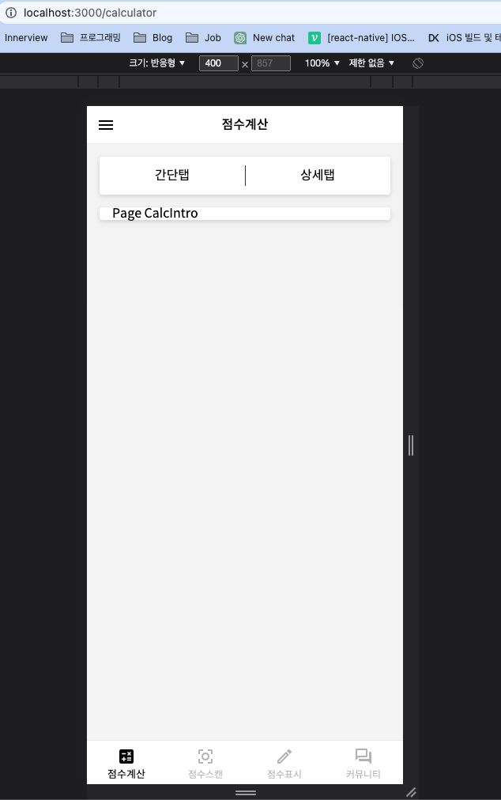
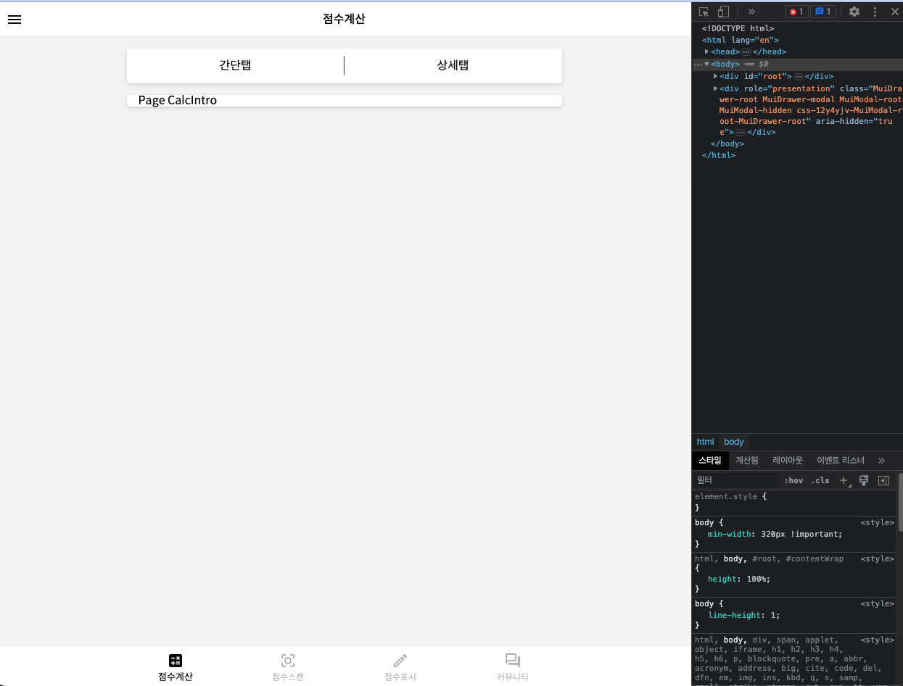
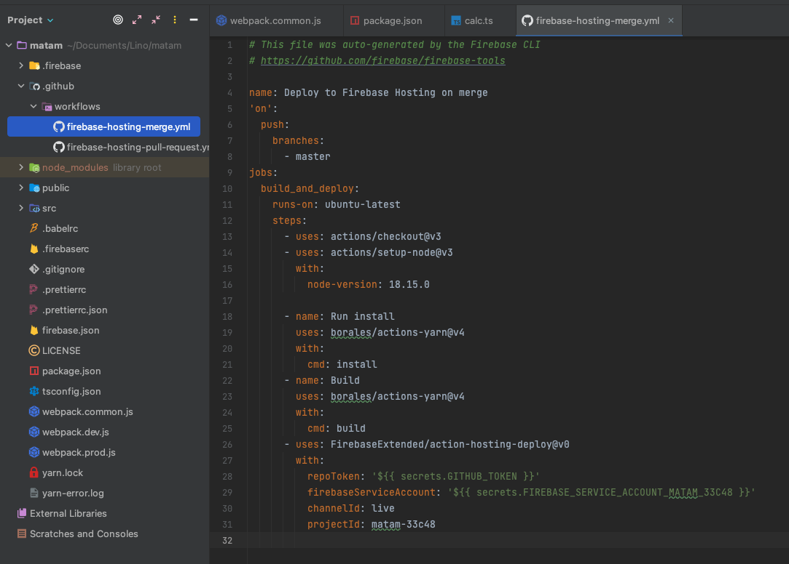
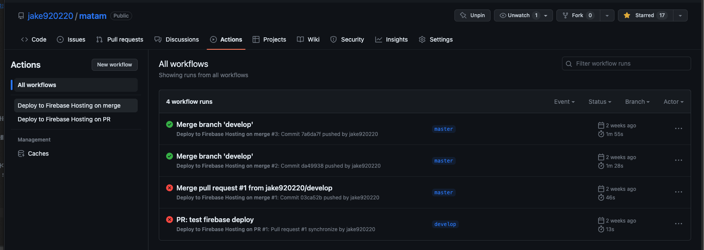
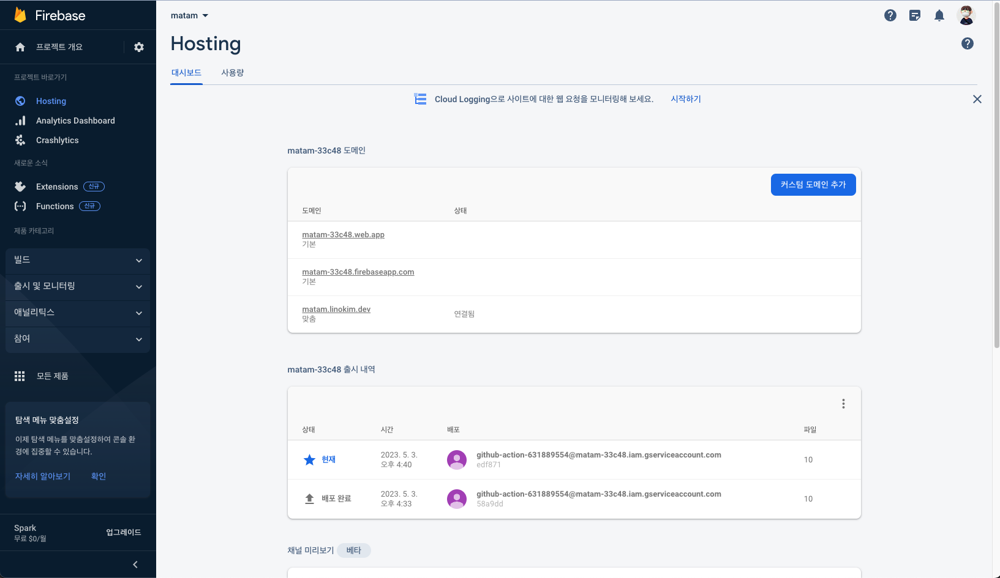
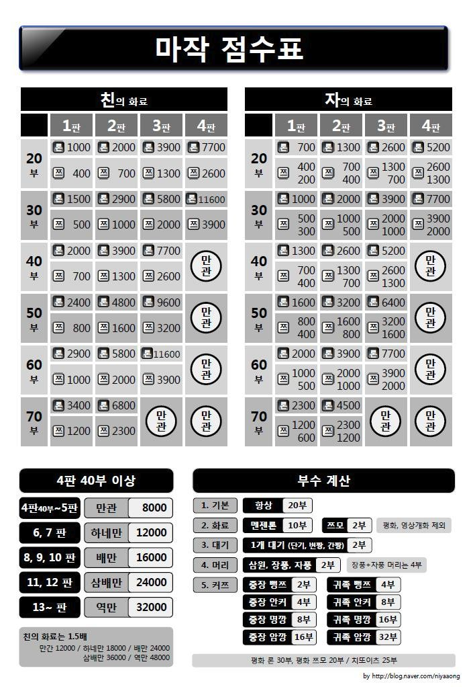
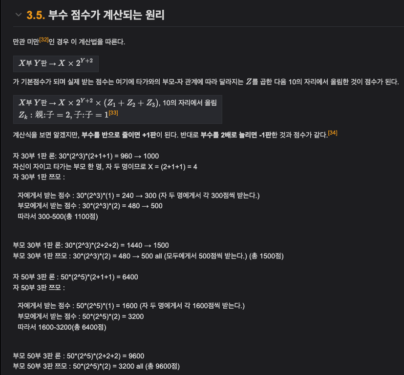

지난 번 [마탐 개발기 ep0](https://blog.linokim.dev/development/matam_create_0/) 에 이은 ep1 포스팅이다.
ep1에서는 어떻게 개발을 진행하고 있는지, 어떤 구상을 했는지를 정리하기로 했다.


## 프로젝트 셋업

우선 프로젝트를 어떤 구성으로 잡을 지 고민을 많이 했었다.

사람들이 마작을 치면서 이용할 예정이니 모바일웹 형태의 디자인으로 개발을 할 필요성이 있었다.

그리고 사용자의 모바일 디스플레이에 앱처럼 내 모바일웹 서비스를 저장하고, 대부분의 기능들이 Client side 에서 이루어질 예정이었기에
PWA의 cache기능을 이용하여 모바일 데이터 연결이 불안정한 상태에서도 이용할 수 있도록 `PWA` 를 채택했다.

SEO를 크게 고려할 필요성이 느껴지지 않아 `React`를 사용하기로 결정했는데, 개발을 1년 반 이상 쉬며 React v18 과 react-router v6가 나와서
기존에 내가 알던 문법과는 여러 가지 달라진 점이 있었기에 새롭게 공식문서를 보며 공부를 다시 할 수 있어 좋았다.

개인적으로 공부만 하고 실무에서는 한 번도 사용해 본 적이 없는 `Typescript` 도 이번 기회에 사용해 보았다.
실무 개발을 하다 보면 업무 일정을 맞추기 위해 아무래도 1~2인 개발을 할 때에는 생산성이 떨어지는 typescript를 쉽사리 도입하지 못했는데,
사용하다보니 여러가지로 내가 생각했던 편견과는 달리 생산성을 떨어뜨리는 부분은 크지 않았고, 코드의 안정성과 신뢰도를 올려주는 데에서는 여러 모로 의미가 크다고 느껴졌다.

`Module bundler` 는 여러 고민 끝에 `webpack`으로 결정했다. `vite`나 `rollup`, `snowpack` 등의 후보군들이 있었고, webpack의 경우 예전에 다루어봐서
크게 새롭지 않다고 생각했었으나, webpack v5가 나오고 역시 내가 알던 것과 다소 달라진 부분들이 있어 공부차원에서 다시 webpack을 채택했다.

Style library의 경우 원래는 `scss`를 참 많이 사용해왔었다. 이번에는 다른 것을 써보고싶기도 했고, 개인 공부에서만 간단하게 써본 적 밖에 없었던 `styled-component`를 사용하기로 했다.
다만 `emotion`과 styled-component 중에서 선택에 고민이 많았는데, 둘 다 똑같은 `js-in-css`형태의 라이브러리이고, emotion의 특징인 `css function`과, styled-component의 특징인
component wrapping 이 두 라이브러리 모두 서로의 장점을 채택해서 실제로 정말 큰 차이가 없었다는 것을 알게되어, 그냥 styled-component를 사용하기로 했다.

처음부터 직접 프로젝트를 구성했고 관련된 코드는 [마탐 깃헙 리포지토리](https://github.com/jake920220/matam) 에서 확인할 수 있다.


## 진행 사항

### 화면




우선 현재 프로젝트의 화면 단 진행사항은 위와 같다.

모바일 이용자들을 고려하여 모바일웹의 형태로 레이아웃을 잡았고 데스크톱에서 사용하더라도 max-width를 600px정도로 설정하여 크게 어색하지 않은 화면 구성을 잡았다.

하단의 네비게이션에서는 각 필요 기능들을 탭메뉴로 정리해놓았고, 향후 커뮤니티를 위한 카카오로그인이나 로그아웃, 개인 기록등을 볼 수 있는 마이페이지 등을 고려하여
햄버거 네비게이션 메뉴를 추가했다.

아이콘은 `mui-material-icon` 을 사용했는데, mui가 자체적으로 모든 라이브러리들을 emotion으로 교체하면서 사실 상 프로젝트에서
styled-component와 emotion 두개의 css preprocessor가 동작하게 되어 emotion으로의 교체를 고려하고 있다.

### 배포 및 호스팅

배포는 `Github workflow` 를 이용하기로 했다. CI/CD 설정이 다 거기서 거기로 큰 차이가 없는데,
예전에 `circle CI`와 `Bitbucket pipeline`을 사용해보았으니, 이번에는 다른 것을 써보고자 선택했다.




다음과 같이 github의 master 브랜치에 푸시될 때 동작하도록 workflow 설정파일을 설정해두고,
github actions 탭에서 정상적으로 배포가 잘 되는지 확인해 볼 수 있다.



파이어베이스에 호스팅을 연결하여 내가 구매한 도메인 (나의 경우 Google Domain) 과 연결해 주었다.
프로젝트는 [matam.linokim.dev](https://matam.linokim.dev) 이곳에서 확인할 수 있다.

### 기능 진척도

다음으로는 서비스 내의 기능 진행사항에 대한 정리이다.

우선 가장 먼저 별도의 서드파티 라이브러리가 필요치 않고, 가장 여러 모로 활용 될 마작 점수 계산 함수를 구현했다.
구현에 있어서의 고민사항과 내가 어떻게 구현했는지에 대해 아래와 같이 정리한다.

<br>

우선 마작의 점수계산은 만관이하의 부판수만 중요하고 그 위는 사실 케이스가 적어서 상수화 시켜놓으면 된다고 판단했다.

다만 만관 이하의 부판수도 분량은 많지만 케이스가 고정되어 있어서 하드코딩하여 상수화 할 지 고민을 했었다.
0부에서 다룬것처럼 마작의 부판수에 따른 점수는 다음과 같다.



위 이미지처럼 만관 이하의 역일 때 나올 수 있는 포인트들은 저게 전부였기에, 여차하면 하드코딩을 하는 것도 방법이였다.
마작 부판수에 따른 점수계산은 사실 공식이 있는데, 실제로 사람들이 마작을 칠때도 복잡한 공식으로 계산을 하는 것이 아니라 저런
점수 테이블을 통째로 외우고 치는 것이기 때문에 하드코딩을 한다 하더라도 크게 잘못됨은 없었다.

다만 이왕 개발하는거 까리하게 계산하는 함수를 만들고 싶었기에 계산 공식을 찾아보았다.



다음과 같은 계산 공식이 있었다.

요는 결국

```javascript
부수 * (2^(2+판수)) * 친/자에 따른 계산
```

이것이 바로 공식이였고 다음과 같이 코딩했다.

```typescript
import { PAN_GRADE } from "../constants";

interface CalcProps {
    pan: number;
    isHead: boolean;
    isRon: boolean;
}

interface UnderMankanProps extends CalcProps {
    bu: number;
}

const ceilUp = (num: number): number => {
    return Math.ceil(num / 100) * 100;
};

/**
 * 만관 이하의 역을 계산해서 return 해준다. 부수로 만관을 넘기는 경우는 calcAboveMankan으로 계산하여 return 해준다.
 * @param pan
 * @param bu
 * @param isHead
 * @param isRon
 */
const calcUnderMankan = 
    ({
     pan,
     bu,
     isHead,
     isRon,
    }: UnderMankanProps): string => {
    const isMankan = checkIsMankan(pan, bu);
    if (isMankan) {
        return calcAboveMankan({ pan: 5, isHead, isRon });
    }

    let calculatedPoint = "";
    const basePoint = bu * 2 ** (2 + pan);
    let total = isHead
        ? [basePoint * 2, basePoint * 2, basePoint * 2]
        : [basePoint, basePoint, basePoint * 2];

    if (isRon) {
        let point = 0;
        total.forEach((item) => {
            point += item;
        });

        calculatedPoint = ceilUp(point).toString();
    } else {
        calculatedPoint = isHead
            ? `${ceilUp(total[0])} ALL`
            : `${ceilUp(total[0])} / ${ceilUp(total[2])}`;
    }
    return calculatedPoint;
};

/**
 * 3판 80부이상, 4판 40부 이상은 만관으로 처리할 수 있도록 true를 반환, 나머지는 false를 반환한다.
 * @param pan
 * @param bu
 */
const checkIsMankan = (pan: number, bu: number): boolean => {
    if (pan < 3) {
        return false;
    } else {
        if (pan === 3) {
            return bu >= 80;
        } else {
            return bu >= 40;
        }
    }
};

const calcAboveMankan = ({ pan, isHead, isRon }: CalcProps): string => {
    let point = PAN_GRADE[pan][isHead ? "head" : "child"];
    let calculatedPoint = "";
    if (isRon) {
        calculatedPoint = `${point < 10000 ? point : point + "!!!"}`;
    } else {
        calculatedPoint = isHead
            ? `${point / 4} ALL`
            : `${point / 4} / ${(point / 4) * 2}`;
    }
    return calculatedPoint;
};

const calcPanBusu = () => {};

export { calcUnderMankan, calcAboveMankan, calcPanBusu };
```

위 코드에 대한 설명은 다음과 같다.

`interface CalcProps` 의 경우 계산에 필요한 props에 대한 interface이다. 
`UnderMankanProps`는 CalcProps를 extends 해와서 부수 라는 property를 추가해주었다.

`ceilUp` 마작의 부판수계산을 통한 점수를 낼 때 10의자리를 올림 해주어야하는 케이스가 있어 100으로 나눈 후
소숫점을 올림처리하고, 다시 100을 곱해주는 함수이다.

만관 이하에 대한 계산함수인 `calcUnderMankan`과 만관 이상 판수에 대한 점수계산 함수인 `calcAboveMankan` 두개의
함수가 있다. 

`calcUnderMankan` 의 경우 판수와 부수를 받고, `calcAboveMankan`의 경우 5판이상의 판수만 받는다.
다만 `calcUnderMankan` 이더라도 4판 40부, 3판 80부는 만관처리이기 때문에, 부수로 인한 만관이 되는지 아닌지를
판별해주는 `checkIsMankan` 이라는 함수를 만들어서 처음에 검사를 해주고, 만관이라면 그대로 `return calcAboveMankan()`처리를 해주었다.

어떤 상황에서도 완벽히 동작하는 계산함수를 만들었으니 이제 이번 주차에는 UI에 입히기만 하면 될 것이다.


## 개발 진행이 다소 느려진 이유

갑자기 며칠 째 `matam` 프로젝트의 진행이 안되고 있는데...

다른 이유는 아니고..


> 사진 속 링크와 함께 떨어져내리는 내 의욕

젤다의 전설 신작이 출시해버리는 바람에 도저히 프로젝트에 집중을 못 하고 있는 상태이니...
혹시 기다려주시는 분들이 있다면 양해 부탁드리며.... ep2는 조만간 포스팅 할 예정이다.
