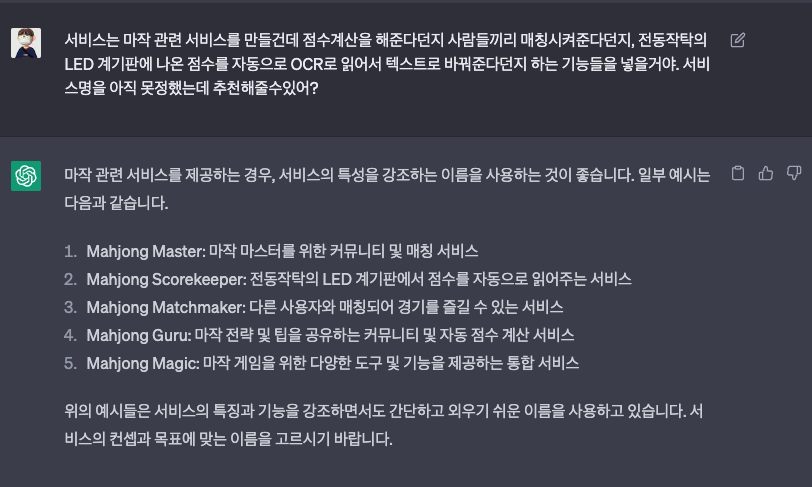
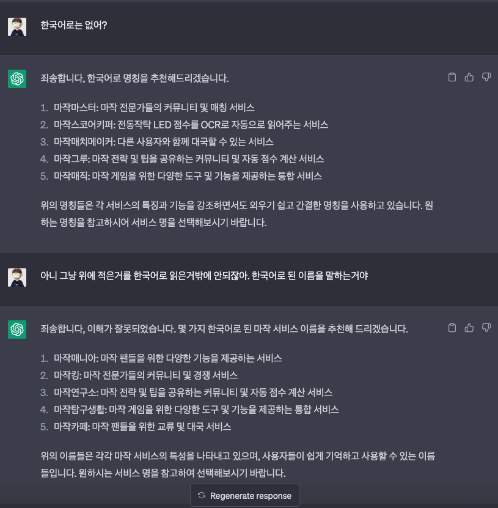
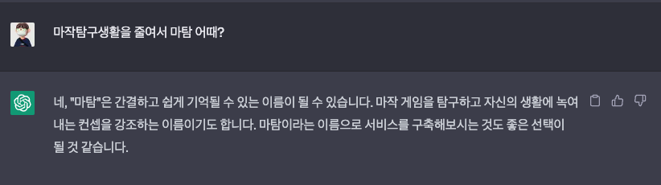
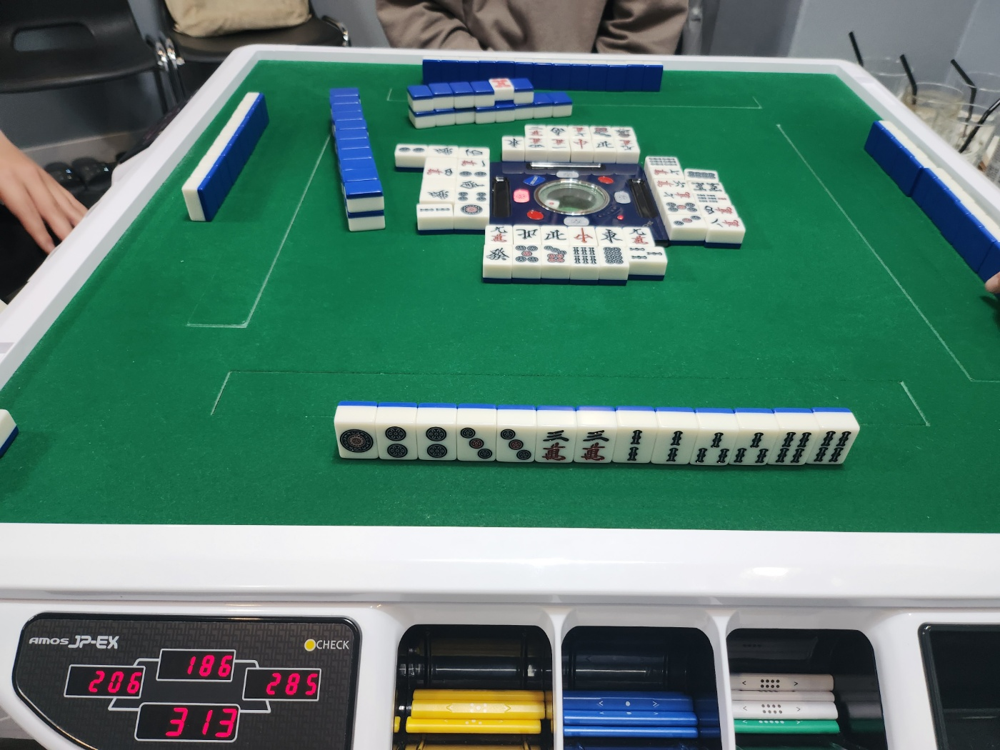
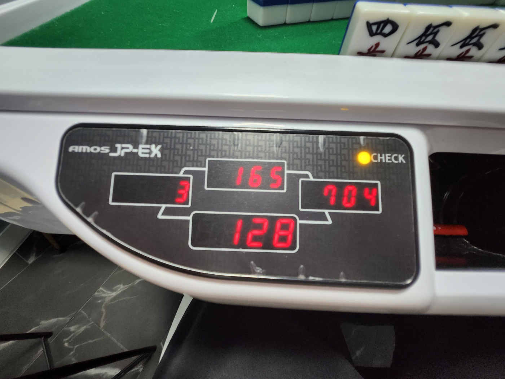

오랜만에 개인 사이드 프로젝트를 다시 시작하며 마음을 다잡아 보기로 했다.  
내가 선정한 주제는 바로 마작으로 10월부터 친구의 권유로 마작에 입문하여 여러 사람들과 함께 하며 번아웃을 이겨내게 해준 최고의 테이블 게임이다.
~~오픈톡방 까치산 마작방에서 함께쳐요~~~

 

## 개발 동기가 뭔데?

마작에는 마작을 플레이 해 본 사람은 누구나 공감할 수 있는, 마작 입문을 가로막는 커다란 진입장벽이 두 개 있다.
하나는 마작의 `역`을 외우는 것이고, 다른 하나는 `점수 계산`이다.  

 

> <b>점수 계산이 뭐 어려워봤자 얼마나 어렵다고?</b>

 

마작의 점수계산 방식을 한번 들여다보자.

 

> 마작의 부/판수표와 그에 대한 위키 설명

  

 

딱 보기에도 한 눈에 쉽게 들어오지 않는다.  
심지어 친(오야)과 자 라는 시스템까지 있는데 서로의 점수계산이 달라서 더욱 어려움을 준다.  
마작을 처음 배울때만 해도 나에게는 이런 계산을 쉽게 도와줄 무언가가 절실했다.  
~~지금은 너무 많이 친 나머지 점수들은 다 외워졌지만.....~~  

 

마작은 4명이서 하는 게임이다.   
내가 다니고 있는 보드게임 카페에서는 대부분의 오래하신 작사님들은 매너가 좋으셔서 초보분들의 역과 판수 부수를 세어주시며 점수도 계산을 해주시는 편이지만, 그건 그분들이 친절을 베푸시기 때문일 뿐 의무가 아니다.  
심지어 보다 전문적인 느낌이 나는 공탁 마장같은 곳은 점수 계산을 하지 못하는 아기 작사들은 마음에 큰 상처를 입고 마작에서 멀어질 우려조차 있다..!  
그리고 초보 4명이서 칠 때는 매우 막막해진다는 점까지 ..

 

결국 마작도우미 서비스를 만들어보기로 마음먹은 가장 큰 이유는 일단 손쉬운 점수계산이 1차 모토였다.

 

## 프로젝트명 탄생 비화

우선 Github repository 이름도 지어야 했고 추후에 서비스명으로 밀어야 할 기깔나는 이름이 필요했다.

개발자들은 아무래도 이런 네이밍에서 의욕이 샘솟는 생물이지 않은가.

한참을 고민해도 그럴싸한 이름이 떠오르지 않았다. 마작헬퍼? 마종헬퍼?? 다 너무 별로였다..

그래서 그냥 똑띠에게 질문을 해서 몇개 뽑아내보기로 했다.

 
.

.

.

> 요 놈이 꼭 때려야 말을 들어

 

어딘가 아파보이는 chatgpt를 한대 때려주자 그럴싸한 이름이 나와서 서비스명은 `matam`으로 지었다.

( [matam github repository](https://github.com/jake920220/matam) repository 주소는 다음과 같은데 Star를 눌러주시면 너무나도 고맙겠습니다...! )

 

## 어떻게 만들건데?

우선 처음에 내가 구상한 기능들은 다음과 같았다.

- 마작의 점수를 계산해주는 기능
- 전동작탁의 LED 계기판을 카메라로 찍으면 자동으로 반환점수를 계산해주는 기능
- 작탁에 LED 점수판이 없거나, 손탁일 경우 보다 쉽게 현재 점수 현황을 알 수 있게 해주는 기능

### 마작의 점수를 계산해주는 기능

우선 이 기능을 이용할 타깃층은 두 그룹으로 나뉜다.

- 본인의 역 정도는 셀 줄 알지만 부수계산이 일체 되지 않는 응애 작사
- 판수와 부수를 읊을 수 있지만 그게 몇점인지 알지 못하는 작사

기본적으로 마작은 4명이서 하는 게임이고, 그 중 한 명 정도는 점수 계산이 빠른 분들이 계시지만,
간혹 지인들끼리 즐기고 싶을때라던지 하는 경우에는 그렇지 못한 상황이 나오게 된다.

"O판 OO부!" 가 나오지만 점수표를 일일히 찾아보면서 계산을 하는 그룹에게는 테이블표를 보는 시간을 줄여주고,

"3판......어.." 하는 그룹에게는 어느 정도 부수의 가이드라인까지 제공해 줄 수 있는 그런 기능을 만들어 주고 싶다.

### 전동작탁의 LED 계기판을 카메라로 찍으면 자동으로 반환점수를 계산해주는 기능

전동작탁에서 마작을 치는 경우 점수봉에 IC칩이 내장되어 있어서, 보유한 점봉에 따라 LED에 점수표시가 되는 소위 `점수표시탁` 이라고 불리는 작탁들이 있다.

그 중에서도 국내에서 마장마다 제일 흔하게 보유하고 있는 `JP-EX` 탁은 다음과 같이 생겼다.

> 단위는 100점이다.

~~점수는 신경쓰지 않아도 된다...~~

마장마다 반환점수의 룰은 다르지만, 내가 다니는 보드게임카페의 경우 게임이 끝났을 때를 기준으로 25,000점을 반환점수로 계산하여 보유한 점수에서
25,000을 뺀 값을 계산해줘야 한다.

위의 사진  128, 3, 165, 704점을 예시로 든다면, 저 상태로 국이 종료되었을 때

12800 - 25000, 300 - 25000, 165 - 25000, 70400 - 25000 으로 계산하여 나온 점수들을 입력하고, 1~4등에 따라 보정 점수를 입력하는 시스템으로 총합 점수가 계산이 된다.

이 때 마작을 할 때마다 25,000점을 암산 하는 것이 생각보다 번거롭고 가끔 잔 실수가 나오기도 하는데, OCR로 작탁의 점수표시 LED를 스캔하여 자동으로 반환점을 계산해주는 기능을 구현하면

많은 이들이 편할 것이라는 생각에 해당 기능을 개발하기로 마음먹었다.

 

### 작탁에 LED 점수판이 없거나, 손탁일 경우 보다 쉽게 현재 점수 현황을 알 수 있게 해주는 기능

위에 언급한 것처럼 전동작탁 중 일부는 LED에 점수를 표시해주는 작탁들이 있지만 조금 저가형의 전동작탁이거나, 마작패만 가지고 전동작탁 없이 손탁을 하시는 분들의 경우는 게임을 플레이하는 내내 점수가 표시되지 않는 불편함이 있다.   
마작은 보편적으로 동장 4국, 남장 4국으로 8국의 게임을 하게 되며 돌아가며 친을 맡는데 친이 이길 경우 연장이라는 시스템이 있고 로컬룰에 따라서 남 4국 이후 서입으로 서장으로 도입하는 경우도 생기게 되는데, 4등을 피하고 1등을
해야하는 게임으로서 중간 중간 지속적인 점수체크가 필수인 만큼 실시간으로 점수가 보이지 않는 경우 수기로 기록하거나 하며 게임 템포가 다소 떨어질 수 있게 된다.   

고인물들도 이용할 수 있는 서비스로서 마탐에 4명의 플레이어의 점수가 오고가는 UI를 구현하여 현재 국의 점수현황 등을 손쉽게 확인할 수 있게 기능을 개발할 계획이다.

 

주저리 주저리 말이 많았지만 여하튼 1차 개발 목표는 점수 계산기를 만들어 자주 이용하는 보드게임카페 회원분들에게 공유해 아이디어를 듣고 더 디벨롭 해볼 예정이고, 그러면서 2차 개발 목표는
점수 스캔을 하는 기능을 구현할 예정이다.

## P.S

위에도 한 번 적긴 했지만.....

[matam github repository](https://github.com/jake920220/matam) Star 한 번만 눌러주시면 너무나도 감사합니다...!
