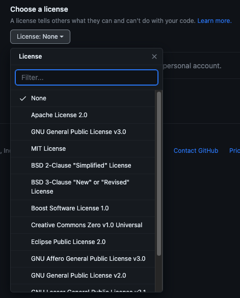
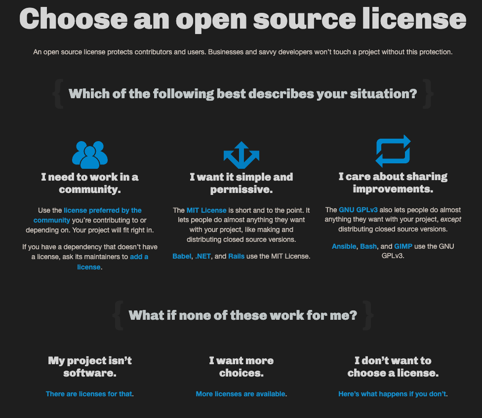

오늘은 오픈소스의 라이선스에 대해서 포스팅을 해보고자 한다.

포스팅 주제를 오픈소스 라이선스로 삼은 이유는 새로운 개인 프로젝트를 진행하고자 했는데, repository를 `public`으로 생성하여 나의 commit과 코딩 스타일 등을 공개하여 하나의 포트폴리오 프로젝트로 사용하고도 싶었고,
누구라도 자유롭게 추후에 `issue`를 달아주거나 `discussion`을 가질 수 있기를 바랐다.

그러면 `public`으로 공개된 내 프로젝트가 어떻게 보호받을 수 있는지에 대해 고민하다가 라이선스 쪽에 대해서 찾아보던 중 알게 된 내용들을 정리해서 함께 공유하고자 포스팅하게 되었다.

------

## 리포지토리 라이선싱

리포지토리 라이선싱은 해당 리포지토리의 소스코드로 할 수 있는 작업과 해선 안되는 작업을 다른 사용자에게 알려주는 역할을 한다.

라이선싱을 하게 되면 오픈소스로 코드를 작성했을 때 누군가가 무단으로 코드를 긁어가서 사용한다던지 하는 것에 대해 허용범위 등을 두어 어느 정도의 제한을 둘 수 있게 된다.

일반 소프트웨어 라이선스와 미묘하게 다르지만 오픈소스도 저작권 등의 지식재산권이 있다. 그래서 권리자의 허락 없이 함부로 사용하면
법적 책임을 물을 수 있다. 다만 오픈소스의 경우 권리자들은 많은 사람들이 자유롭게 사용할 수 있도록 광범위한 라이선스를 부여하는 편이다.

 

## 나에게 맞는 라이선스는?

위 사진은 Github에서 리포지토리를 개설할 때 라이선스 처음에 라이선스 선택지를 묻는 select box 이다.

한 눈에 들어오지 않는 여러 종류의 라이선스들이 있고 각각은 무엇을 하는지 명확히 와닿지 않는다.

> [choosealicense.com](https://choosealicense.com/)

위 링크는 나에게 맞는 라이선스들을 제시해주며 각각이 어떤 장단점이 있는지를 정리해놓은 사이트이다.

좀 더 자세한 라이선스의 범위와 종류에 대해 알고 싶다면 [오픈소스 sw 라이선스 종합정보시스템의 비교표](https://olis.or.kr/license/compareGuide.do)를
통해 정보를 얻을 수 있다.

우리가 흔하게 개발을 하다보면 마주치는 `MIT 라이선스`는 라이선스 및 저작권 명시, 상업적 이용이 가능하고 수정 배포 특허신청 등을 할 수 있다.
상당히 제약조건이 느슨한 편이며 그래서 대다수의 오픈소스들이 MIT 라이선스를 채택한다.

 

## 라이선스를 부여하지 않으면??

라이선스는 반드시 선택해야하는 의무는 없지만 라이선스를 선택하지 않으면 기본 저작권법이 적용되어 그 누구도 소스코드에 대한 결과물을 재현하거나 배포, 파생결과물을 만들 수 없어
오픈소스로 만드는 의미가 퇴색된다.

오픈소스는 누구라도 버그를 수정하거나 이슈를 제기하거나 하는 등의 contributing을 할 수 있고, 오픈소스를 통해 다른 아이디어를 얻어 기능을 개발하거나 할 수 있는
방식이기 때문이다.

그래서 주의해야 할 부분은 Github등에 Public으로 공개된 프로젝트이더라도 라이선스가 적용되어 있지 않은 프로젝트들은 무단으로
수정 배포 가공 등을 해서는 안되고, 최악의 경우 법적인 책임을 물을 수도 있어서 조심해야 한다.

[출처 - Github Docs 리포지토리 라이선싱](https://docs.github.com/ko/repositories/managing-your-repositorys-settings-and-features/customizing-your-repository/licensing-a-repository#choosing-the-right-license)
[출처 - choosealicense](https://choosealicense.com/)
[출처 - SKTelecom license guide](https://sktelecom.github.io/guide/use/license/)
[출처 - 오픈소스 소프트웨어 라이선스 종합정보 시스템](https://olis.or.kr/license/compareGuide.do)

