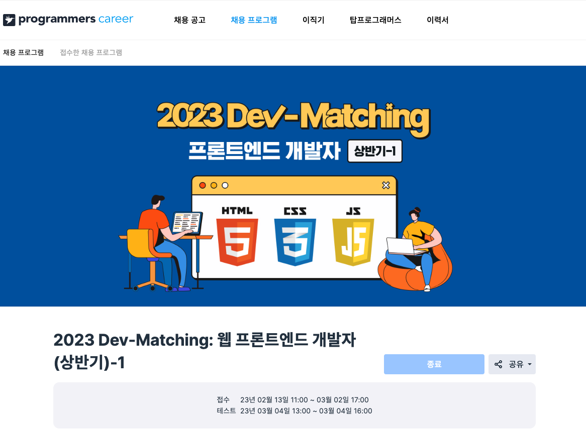
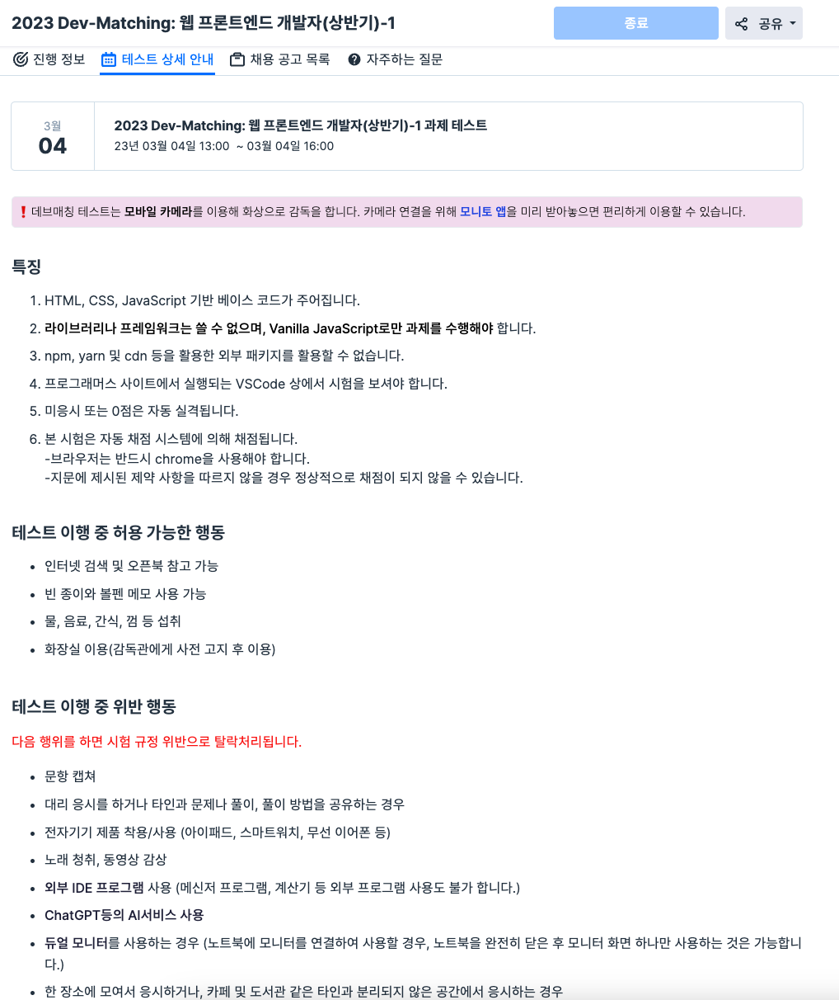
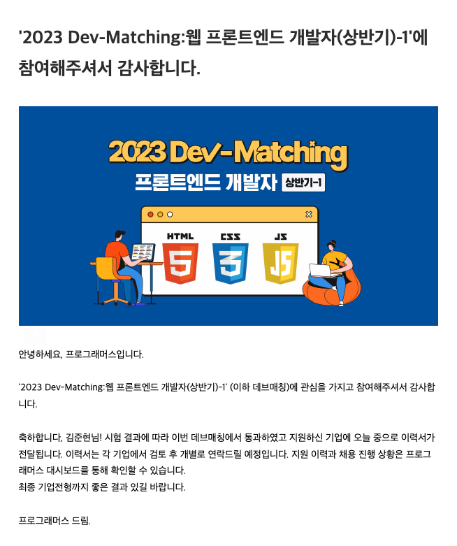

구직 준비를 하는 동안 프로그래머스에서 2023 Dev-Matching 프론트엔드 개발자 상반기 채용 프로그램을 알게 되어 지원하게 되었다.
시험에 대한 상세한 내용을 적을 수는 없지만 그 점을 제하고 이번 데브매칭을 응시한 후기에 대해서 포스팅 하기로 하였다.

 

## 데브매칭이 뭔데?

 

> 2023 Dev-Matching 웹 프론트엔드 개발자 상반기 채용 프로그램 대문 사진이다.

 

데브매칭은 프로그래머스에서 몇 년간 주최하고 있는 웹 개발자 채용 프로그램으로 백엔드와 프론트엔드가 나뉘어 온라인으로 과제 및 코딩테스트를 응시한 후 전형에 통과한 개발자들의 이력서를 기업들이 열람하고 컨택을 하게 되는 구조로 되어 있다.

기업에서 면접을 진행하면서 내부적으로 코테나 과제를 따로 더 진행할 수는 있지만, 프로그래머스라는 플랫폼을 통해서 기업들은 지원자를 한 차례 필터링 할 수 있고, 지원자들은 자신의 레벨을 파악하여 부족한 점을 보완하기에 좋아 좋은 채용프로그램으로 보인다.

 

## 특징과 룰

 

데브매칭은 온라인으로 진행되며 프론트엔드 전형의 경우 주어진 과제를 제한 시간 내에 만들어 제출하는 것을 목표로 한다.

특징으로는 명시된 대로 바닐라 자바스크립트만을 이용하여 개발하여야 하며 외부 IDE를 이용할 수 없고 프로그래머스 사이트 내의 VSCode를 사용해야 한다. 

과제를 진행하기 전에 모니토라는 모니터링 앱을 설치 후 핸드폰을 응시자의 손, 측면 상반신, 키보드, 시험이 응시되는 모니터 등이 보이는 각도로 두어서 온라인 감독관에 의해 부정행위가 일어나는지 확인이 이루어진다.

테스트 중에는 인터넷 검색이나 오픈북이 허용되었으며, 3시간의 긴 시간이라 그런지 물 음료 간식등의 섭취가 가능했고 감독관에게 사전에 고지하면 화장실을 이용하는 것도 가능했다.

다만 시험 문항을 캡쳐하거나 대리 응시, 전자기기 제품 착용이나 듀얼모니터 이용, 분리되지 않은 공간에서의 응시 등 기본적으로 부정행위가 일어날 수 있는 모든 요소들은 규정 위반으로 탈락처리를 받게 된다.

 

## 응시 후기 및 개인적인 팁

 

나의 경우 처음으로 온라인 코딩테스트 (과제)를 응시한 것이다 보니 여러 가지로 준비를 갖추고 응시를 했다.

데브매칭 페이지에서는 이전 데브매칭 과제전형들을 체험해볼 수 있게 문제들을 제공해주는데 미리 들어가서 문제의 수준을 파악하고, 온라인 VSCode 이다 보니 내가 설정해둔 환경들을 빠르게 적용하기 위해 미리 숙지해두어 어색함을 줄였다.

1시에 시작하는 시험이니 12시 35분 정도부터 미리 거치대에 핸드폰을 거치시키고 명시된 대로 모니토 앱에 화면이 잘 잡히는지 사전에 확인도 했고, 간식과 물 음료등이 섭취 가능하지만 자리에서 일어나서 가져오거나 할 수 없으므로 책상에 물과 커피 한캔을 준비해 두었다.

 

출제된 문제의 난이도는 높은 편이 아니었으나 내가 번아웃으로 너무 오래 쉬었던 점도 있었고, 프레임웍이나 라이브러리의 도움 없이 바닐라 자바스크립트로만 구현 및 코딩을 하려니 여간 어색한 것이 아니였다.

그리고 나는 보통 특정 Feature나 Component를 구현하기 전에 앞서 공책에 볼펜으로 끄적끄적 적어보고 충분히 생각을 정리한 뒤 코딩만 바로 해버리는 스타일이였는데 노트와 펜을 준비하지 못했으며 제한 시간이 있다 보니 마음이 급해져서 함수를 만들었다가 확장성 등을 고려하지 못해서 몇 번이고 지웠다가 다시만들고 하였다.

이 블로그를 보게 되는 분들은 꼭 노트를 따로 준비하면 좋을 것 같다 : )

2개의 기능 구현 과제가 있었는데 크게 어려운 것 없었음에도 제한 시간 3시간이 금방 지나갔다.

나의 경우 삽질을 좀 하다가 정말 마지막에 너무나도 간단한 항목 하나를 구현 못한 채 3시간이 되어 자동 제출되며 창이 닫혔다.

 

> 데브 매칭 응시 후 결과 이메일은 열흘 정도 후에 받을 수 있다.

 

이 후 열흘 후에 데브매칭 응시 결과 이메일을 받게 되어 확인해 보니 과제 전형에서 합격하였고, 내가 지원 관심으로 두었던 채용공고를 올렸던 회사들에 나의 이력서가 제공되게 되었다.

개인적으로 코드를 좀 더 이쁘게 다듬을 수도 있었으나 3시간 내에 구현하느라 리팩토링을 하지 못한 점과 한 가지 항목을 적용 하던 코딩 도중 시험이 제출되어 버렸다는 점에서 크게 기대를 안 하고 있었으나 합격 이메일을 받게 되어 얼떨떨했다.

후기라고 한다면 역시 위에 적었듯이 데브매칭이라는 채용 프로그램은 기업 입장에서 지원자들을 사전에 필터링 할 수 있다는 장점도 있으나, 지원자의 입장에서는 자신의 부족함 및 보완해야 할 점을 파악하기 좋다는 데에 큰 의미가 있는 것 같았다.

나의 경우 바닐라 자바스크립트로 구현한 것이 5~6년만이다 보니 검색하는데 시간을 꽤 많이 지체했다는 점과 코딩을 너무 쉬었다는 점이 느껴져서 이번 시험을 계기로 아쉬운 점을 되돌아 보게 되어 다시 금 의지를 불태울 수 있게 되었다.

오랜만의 코딩이였는데 3시간 동안 시간가는줄 모르고 코딩을 했고 정말 오랜만에 해보니 너무 재밌어서 역시 개발자의 길을 택하길 잘했다는 생각이 들어 좋았던 경험인 것 같다. : )