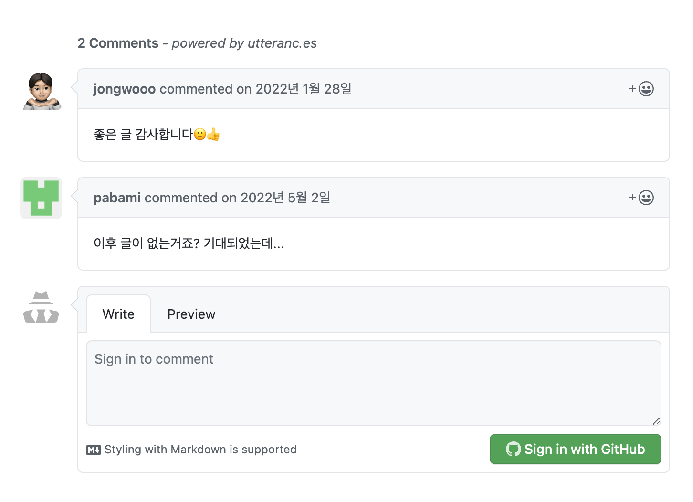

블로그 포스팅을 다시 재개하기로 하였다. 
포스팅을 다시 시작하자고 마음먹은 것도 몇 달은 되었으나 이제서야 다시 시작하게 되었다. 
거의 2년만의 재개인데 그 동안 참 많은 일이 있었다. 

 

### Orderspot (Crave)를 다니며

외국계 스타트업에 온보딩하여 1년 6개월 가량의 근무를 하며 시간을 보냈다. 
이전 회사들에 비해 업무강도가 심한 회사는 아니였으나 재택근무는 내게 맞지 않는 옷 같았고 회사에 한국인이 대표 한명 뿐이여서
영어로만 의사소통을 했는데, 업무적으로는 큰 문제가 없었으나 재택이라는 환경과 언어적 장벽이 겹쳐져 스몰토크가 어려워지니 소속감이 떨어지며
이전 회사들에서 누적되었던 심한 업무강도로 인한 번아웃이 터지고야 말았다.

사람들은 참 좋았기에 회사에서는 여러 번 휴식의 시간을 제공해주고 외국인 개발자 동료들은 번아웃은 어느 개발자들에게나 찾아오는 것이라며 위로해 주었으나
한 번 밀려들어온 번아웃을 이겨내기는 참 쉽지 않았다. 
그렇게 나는 5월 25일에 퇴사를 했다.

 

### 퇴사 이후

5월 말에 퇴사 하신 뒤로 무엇을 하셨나요? 라고 묻는다면 부끄럽게도 할 이야기가 많지 않다.
퇴사 세상에는 이후 참 많은 일들이 있었다. 
홍수가 나서 강남이 물에 잠기고, 카카오 서버가 터지기도 하였으며 4년에 한번 열린다는 월드컵도 지나갔다. 
드라마를 잘 안보는 내가 수리남과 재벌집 막내아들 붐이 일어서 열심히 챙겨보기도 하였다. 

그러는 동안 나는 참 휴식을 많이 했다. 
못만났던 친구들을 열심히 만났으며 울산과 제주도로 여행을 다녀왔다. 아버지께 운전 연수를 열심히 받아 장롱면허를 탈출하고 렌트카로 제주도 방방곡곡을 돌기도 했다. 
다이어트를 하여 15kg정도의 감량을 하였으며 친구의 권유로 마작을 배워 동네 보드게임카페 사람들과 많이 친해지며 마작도 열심히 쳤다. 
지쳤다는 이유로 개발만을 지난 반 년간 손에서 뗐다. 
그러다 한 번 면접을 볼 기회가 생겨 면접을 보러갔는데 화기애애하게 진행되던 면접이 기술면접으로 들어가면서 내가 알던 것들조차 제대로 대답을 못하고 
결국은 불합격 하게 되었는데, 너무 오래 쉬며 많이 까먹은 상태에서 얻은 충격이 제법 있었나보다.

 

### 이제 어떻게 할 것인지?

2년만에 포스팅을 재개하는 블로그의 마지막 포스팅에는 저런 댓글이 두개 달려있었다. 
하나는 좋은 글 감사하다는 격려의 댓글, 하나는 기대되었는데 이후 포스팅이 없냐는 댓글. 
바쁘다는 핑계로, 번아웃이라는 핑계로 블로그 자체를 열어보지 않던 내게 너무 창피하고 반성을 많이 하게 만들어주었던 댓글들이였다. 

이제는 번아웃이라는 수렁에 빠져있던 나에게 스스로 다시 한번 기회를 주려고 한다. 
취직해서 바빠지더라도 바쁘다는 핑계없이 내가 블로그 포스팅을 롱런하며 자기개발을, 다른 이들에게도 도움과 영감을 줄 수 있는 사람이 될 수 있었으면 좋겠다. 

모쪼록 힘들고 부끄러웠던 2022년을 지나 2023년은 다시 새롭게 도약한다는 마음으로, 또 나와 같이 번아웃에 고통받고 있는 수많은 분들에게도 이 글이 도움이 되었으면 좋겠다.