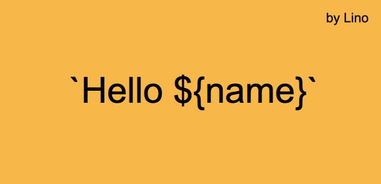

이번 포스팅은 styled-components를 사용하면서 처음 접하게 된 Tagged template literals를 기존의 Template literals와 함께 정리하기로 했다.

## 템플릿 리터럴(Template literals)



템플릿 리터럴은 ‘따옴표’나 “이중 따옴표” 대신 ``` `백틱(Backtick)` ```을 사용하여 문자열을 표현할 수 있다. ES6에서 도입되었으며 템플릿 리터럴을 사용하여 문자열을 표현할 때에는 따옴표나 이중 따옴표를 사용하는 것에 비해 다음의 장점이 있다.

<br>

- **Multi-line string 표현이 편하다.**
- **따옴표와 이중 따옴표를 문자열에 내포시키기 편하다.**
- **문자열에 변수를 함께 쓰기에 편리하다.**

<br>

### Multi-line string 표현이 편하다.

기존의 자바스크립트 문법에서 multi-line string을 표현하기 위해서는 다음과 같이 코드를 작성해야 했다.

~~~javascript
var multiLineStr = "천일의 연습을 단이라 하고\n" +
"만일의 연습을 련이라 한다.";

/** output
"천일의 연습을 단이라 하고
만일의 연습을 련이라 한다."
**/
~~~

template literals에서는 다음과 같이 편리한 작성이 가능하다.

~~~javascript
let multiLineStr = `천일의 연습을 단이라 하고
만일의 연습을 련이라 한다.`;

/** output
"천일의 연습을 단이라 하고
만일의 연습을 련이라 한다."
**/
~~~

<br>

### 따옴표와 이중 따옴표를 문자열에 내포시키기 편하다.

기존 자바스크립트에서는 문자열에 이중 따옴표를 넣기 위해서 문자열을 단일 따옴표로 처리하곤 했다.

~~~javascript
var str = '"반복이 힘이다."';

// output
// "반복이 힘이다"
~~~

따옴표를 넣고 싶을 때에는 반대로 이중 따옴표로 string을 선언해주면 그만이었다. 그러나 부득이하게도 종종 따옴표와 이중 따옴표를 모두 사용하고 싶은 경우가 생기게 마련이다. 그런 경우는 불편하더라도 다음과 같이 처리하곤 했다.

~~~javascript
var str = "'따옴표와 이중 따옴표를 다 넣고 싶은데..'"+' "어쩌면 좋지?"';

// output
// '따옴표와 이중 따옴표를 다 넣고 싶은데..' "어쩌면 좋지?"
~~~

템플릿 리터럴은 다음과 같이 간략하게 표현이 가능하다.

~~~javascript
let str = `'따옴표와 이중 따옴표를 다 넣고 싶은데..' "어쩌면 좋지?"`;

// output
// '따옴표와 이중 따옴표를 다 넣고 싶은데..' "어쩌면 좋지?"
~~~

<br>

### 문자열에 변수를 함께 쓰기에 편리하다.

기존 자바스크립트에서는 문자열의 사이에 변수를 넣고 싶을 때 다음과 같이 코드를 작성해야 했다.

~~~javascript
var name = "자성이";
var joongu_speach = "오늘이 이사회 날이냐? " + name + "한테 축하한다고 전해줘라.";

// output
// 오늘이 이사회 날이냐? 자성이한테 축하한다고 전해줘라.
~~~

template literals 에서는 $와 중괄호를 사용하여 `${expression}` 변수를 그대로 표현할 수 있다. 이를 Expression interpolation 이라고 부른다.

~~~javascript
let name = "자성이";
let joongu_speach = `오늘이 이사회 날이냐? ${name}한테 축하한다고 전해줘라.`;

// output
// 오늘이 이사회 날이냐? 자성이한테 축하한다고 전해줘라.
~~~

이렇게 template literals는 매우 편리하게 문자열을 표현하게 도와준다.

<br>
<br>

## Tagged template literals

이번에 styled-components를 사용하면서 처음 접하게 되었다. 사실 새롭게 나온 기술은 아니다. ES6에 template literals와 함께 나왔으나 사용할 기회가 없어 완전히 모르고 있었다. 생김새는 이름에서 알 수 있듯이 템플릿 리터럴에 태그가 붙어있는 형태이다. 직접 확인해보자.

~~~javascript
const count = "3";
const teacher = "스승";

const ttl = (str, ...args) => {
  console.log(str);
  console.log(args);
}

ttl`${count} 사람이 함께 길을 가면 그 중 반드시 나의 ${teacher}이 있다.`;

/** output
str: ["", " 사람이 함께 길을 가면 그 중 반드시 나의 ", "이 있다."]
args: ["3", "스승"]
**/
~~~

첫 번째 인자에는 parameter를 기준으로 문자열을 split한 배열이, 그 이후로는 parameter들이 순서대로
arguments로 넘어온다. 크게 어렵지 않지만 Tagged template literals를 모르는 채로 하단의 표현식을 처음 조우하게 되면 굉장히 당황스러울 수 있다.
<br>
styled-components를 사용하면서 처음으로 알게 되었지만 경우에 따라서 Tagged template literals를 사용해서 더 스마트한 문자열을 만들어낼 수 있을 것 같고 활용은 무궁무진하게 열려 있을 것 같다.
