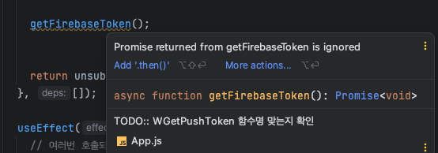
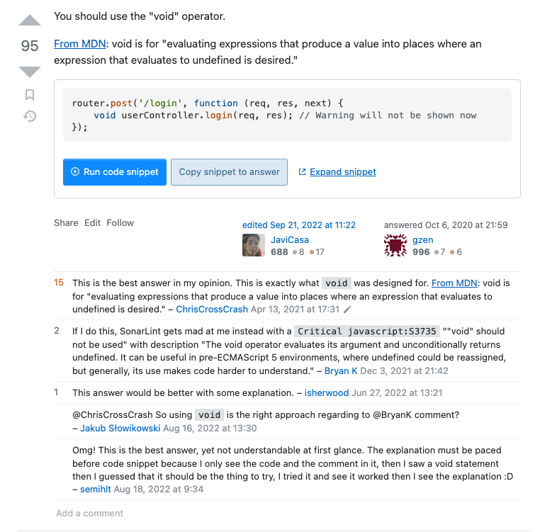

이번 포스팅은 Javascript에서 `void` 연산자에 대해서 다루어 보기로 했다.

## 갑자기 웬 Void?

이번에 새로 다니는 회사에서는 IDE를 webstorm을 쓰기 때문에 나도 덩달아 webstorm을 사용하게 되었다.
홍대의 모 회사를 다닐 때 이후로는 늘 vscode를 사용했으니 대략 3~4년만에 다시 사용해보는 IDE였다.

useEffect 내부에서 비동기 함수를 하나 실행시킬 일이 있었는데 해당 함수는 firebase의 FCM 토큰을 가져오는 함수로
useEffect 에서는 return이 `cleanup function`의 역할을 하기 때문에

```javascript
useEffect(async () => {
  // ...
  await getFirebaseToken()
}, [])
// getFirebaseToken는 Promise를 반환 => 에러가 발생할 수 있다.
```

위와 같이 사용하면 Promise를 return 하게 되고, 에러가 발생할 수 있다.
그렇다고 아무 리턴값이 없는 get 함수를 변수에 할당할 필요성도 느끼지 못했고, `getFirebaseToken()`이라는 함수는 비동기적으로 실행된다고 해서
문제가 발생할 일이 없는 함수였기에 그냥 다음과 같이 사용했다.

```javascript
useEffect(() => {
  // ...
  getFirebaseToken()
}, [])
```

그런데 vscode에서는 아무런 위화감 없이 사용하던 부분이였는데 webstorm에서는 다음과 같은 warning이 발생했다.



> Promise returned from \${functionName} is ignored

요는 저 함수에서 반환된 프로미스가 무시되었다. 라는 내용인데....

알고있는 사실이기도 하지만 저렇게 warning을 남기니까 묘하게 기분이 좋지 않았다..

그래서 해당 warning을 제거하기 위해 구글링을 했는데 stackoverflow에 나와 같은 질문을 올린 [질문글 (출처: stackoverflow)](https://stackoverflow.com/questions/41278900/intellij-idea-warning-promise-returned-is-ignored-with-aysnc-await)을
보게 되었다.

해당 스택오버플로우 글에서 제일 채택을 많이 받은 답변은 아래와 같았다.

<br>



> [답변 링크](https://stackoverflow.com/a/64234381)

<br>

`void` 연산자를 함수 앞에 붙이는 것은 `javascript`에서는 생각조차 하지 못했던 부분이였다.

Java나 C를 공부했을 때는 `void`가 갖고 있는 의미는 해당 메서드가 반환값이 없다는 것을 의미했던 것으로 기억하고 있는데,
함수의 Argument 인자까지 고정하는 Java나 C와는 달리 유연한 언어인 (여러가지 의미에서...) `javascript'에서는 함수의 반환값에 대한 설정이 필요치 않았기에 한 번도 신경 써본 적이 없었고,`void`가 존재하는 지도 모르고 있었다.

다만 typescript를 공부했을 때에는 `void`에 대해 본 적이 있었기에 기억에서 완전히 잊혀져 있던 친구는 아니였다.

여하튼 위의 stackoverflow 글대로 `void`를 함수 앞에 추가해주니 IDE에서 보내던 warning은 사라지게 되었다.

<br>

## 그러면 이걸 써도 되는건가?

<br>

일단 warning이야 없어졌지만 그렇다고 좋다고 쓰기에는 무리가 있다고 생각했다.

[MDN의 공식문서](https://developer.mozilla.org/ko/docs/Web/JavaScript/Reference/Operators/void)에 기술된 `void` 연산자에 대한 설명을 읽어보면 `void`는 주어진 표현식을 평가하고 `undefined`를 return한다 라고 되어있다.

당연히 Promise를 return하는 함수의 return값이 `undefined`가 되었으니 warning이 사라지는 건 맞고, 반환값이나 순서가 중요하지 않았던 이상
동작에 큰 문제를 주지도 않기는 하지만, 그냥 쓰자니 여러모로 찝찝한건 매한가지였다. warning을 놔둔 채로 `void` 없이 사용하는 것과 큰 차이가 없었기 때문이다.

사용해도 문제가 없고 동작에도 지장을 주지는 않지만, 기본적으로 `void` 연산자를 `javascript`에서 사용하는 것은 가독성적인 측면에서 썩 좋지 않아 권장되지 않고 있다.

<br>

## 그러면 왜 있는 것인지

<br>

몇 년을 `void` 연산자가 `javascript`에 존재한다는 사실도 모르고 있었고 그럼에도 전혀 문제가 없었는데, `void` 연산자는 그렇다면 대체 왜 존재하는 건지 궁금했다.

딱히 찾아도 큰 정보가 나오진 않았지만, Javascript라는 언어가 만들어지면서 이전 언어들에 존재하던 `void` 연산자를 함께 가져오며, `javascript`의 유연함으로 인해 대부분의 경우에 사용되지 않아 필요성이 없어졌지만 남아있게 된 케이스가 아닐까 하는 예상을 하게 되었다.

`javascript`에서 `void`가 사용되는 가장 대표적이자 보편적인 케이스는 검색했을 때 많이 나오지만 아래와 같았다.

```javascript
<a href="javascript:void(0)" onclick="alert('Clicked!')">
  Click me
</a>
```

위 코드는 a태그를 클릭했을 때 `undefined`를 return 시킴으로서 a태그 자체가 갖는 링크의 기능 자체를 동작하지 않게 한다.

마크업을 많이 해본 사람들의 경우 알겠지만 웹표준을 지키며 마크업을 할 때 가장 중요한 것은 목적에 맞게 사용된 html element이다.

javascript에서 `event`가 있는 `button`이나 `input`등의 element들의 경우 `onclick` 시 `event.preventDefault();` 처리를 함으로써
해당 element가 가지고 있는 본연의 동작을 막고 다른 코드를 통해 원하는 제어를 설정할 수 있으나, a태그의 경우 그러지 못해서 보통 빈 문자열로 처리하는 경우도 많았지만, 빈 문자열보다는 `void`를 통해 링크를 `prevent` 시키는 것이 더 좋은 동작이고, a태그의 목적성까지 가져갈 수 있는 이점이 있다.

<br>

## 마치며

`javascript`에서 `void` 라는 연산자는 일종의 고대의 기술 같은 것으로 결론을 내렸다.
일종의 오파츠이자 Starcraft로 치면 공허의 유산 같은거다...


실제로 사용 자체도 그렇게 권장하고 있지 않고 모른다고 전혀 개발에 지장이 없는 요소다.
다만 다른 언어에 대한 지식없이 typescript를 공부하는 사람들은 마주쳤을 때 다소 생소한 요소일 수 있고
`javascript`에서도 `void`가 존재한다는 것을 알았을 때 이게 왜 존재하는지, 언제 사용하는 지에 대해 고민해보고, 검색하며 개발자로서의 호기심을 해소하기 위해 여기저기 검색해본 나같은 다른 사람들에게 이 포스팅이 유용하길 바란다.

<br>

> 참고한 레퍼런스들

https://developer.mozilla.org/ko/docs/Web/JavaScript/Reference/Operators/void

https://stackoverflow.com/questions/41278900/intellij-idea-warning-promise-returned-is-ignored-with-aysnc-await
