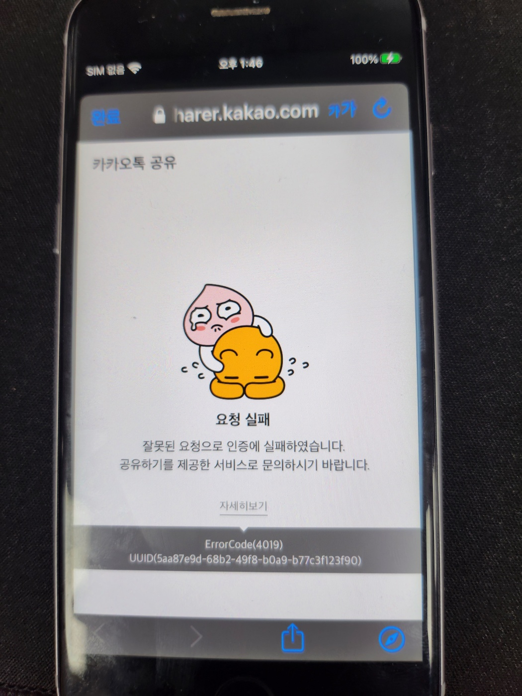

이번에 회사에서 리액트 네이티브 프로젝트를 하나 맡게 되었고 여러 기능들 중 카카오 공유하기를 연동했던 것을 포스팅 해보려 한다.

<br>

## 세팅


> 카카오 메시지 API 공식 문서 화면

<br>

기본적으로 카카오 공유하기 API 는 카카오 메시지 API에 포함되어 있다. [이곳의 공식문서](https://developers.kakao.com/docs/latest/ko/message/common#intro)를 살펴보며 카카오 공유하기와 메시지 API의 동작원리에 대해 전반적인 이해를 그림과 설명을 통해 수월하게 이해할 수 있다.

개발자문서 좌측 네비게이션을 보면 웹에서 사용하는 Javascript SDK와 Android, iOS, Flutter SDK 가 각각 나뉘어 있는 것을 확인할 수 있다.

<br>


> Flutter는 있는데 왜 RN용은 없는지 어이가 없는 모습~

<br>

네이티브를 모르는 나로서는 리액트 네이티브도 따로 모듈을 하나 만들어서 SDK로 내어줬으면 싶었지만 카카오 공식 SDK는 없고, 다행히도 한 개발자분께서 직접 네이티브 모듈을 래핑하여 RN 모듈로 개발해 놓으신 것을 사용하게 되었다.

[react-native-kakao-share-link 깃헙](https://github.com/millo-L/react-native-kakao-share-link)

<br>

기본적으로 README에 가이드를 아주 상세히 적어두셔서 그대로 따라하면 큰 문제 없이 기능이 작동한다.

~~(나는 iOS에서 search path에서 usr/lib/swift 5.0을 제거해주라는 글을 졸려서 보지 못했고 맞닥뜨린 에러를 M1 이슈인줄 알고 2일을 개삽질을 했다.)~~

그 전에, 우리가 해주어야 할 일이 하나 있다.

<br>

## 카카오 디벨로퍼스 세팅

<br>

카카오 공유하기 API를 이용하기 전에 우선 우리는 프로젝트를 등록하고 네이티브 앱 키를 발급받아야 한다.


[Kakao Developers](https://developers.kakao.com/) 에 접속하여 로그인 후 상단의 애플리케이션을 눌러 앱에 사용할 새 애플리케이션을 생성해 준다.

<br>


> App key와 프로젝트명은 가린 상태

생성을 마치면 다음과 같은 화면을 보게된다. 우리는 Android와 iOS플랫폼에서 카카오 공유하기를 이용할 거니까 네이티브 앱 키를 복사해서 사용하면 된다. 그 전에 한가지 주목해야 할 부분은 사진의 `플랫폼` 부분이다. 우리는 Android와 iOS 플랫폼을 이용할 것을 명시해줘야 하기에 플랫폼 설정하기를 눌러준다.

플랫폼 설정하기를 누르면 Android와 iOS 의 플랫폼을 등록하는 화면이 나오는데 안드로이드의 경우 패키지네임과 key hash를 등록해주면 되고 iOS의 경우 bundler ID를 입력해주면 된다.

안드로이드의 keyhash 를 구하는 방법은 다음과 같다.

```
keytool -exportcert -alias androiddebugkey -keystore ./android/app/debug.keystore -storepass android -keypass android | openssl sha1 -binary | openssl base64
```

다음과 같이 사용중 으로 표시가 되면 Android, IOS 양 쪽의 플랫폼 등록을 마치게 되며 모듈을 사용할 준비가 마무리 된다.


[react-native-kakao-share-link 모듈](https://github.com/millo-L/react-native-kakao-share-link) 의 경우 세팅 순서가 친절하게 설명되어 있으므로 프로젝트 내부에서의 세팅에 대해서는 별도로 설명하지 않는다.

> 혹시 진행 중 문제가 생기는 부분이 있을 경우 github issue에 등록하니 굉장히 빠른 시간 안에 답변을 달아주셔서 크게 도움이 되었다.

> 어딘가에서 막히신 분들은 블로그에 댓글을 적어주셔도 제가 아는 한도 내에서 최대한 도와드리겠습니다 : )

## 프로젝트 단에서의 사용

기본적으로 깃헙 README 하단에 사용법이 상세하게 나와있지만 나는 저 중에서 딱히 위치나 가격 등에 대한 정보를 공유하기에 담고 싶지 않아 `sendFeed`를 이용했고 원하는 옵션들을 설정해주었다.

나의 경우 util함수로 빼서 다음과 같이 사용했다.


나같은 경우 기존에 만들어진 프로젝트를 웹뷰에서 공유하는 경우였기에 `WEBVIEW_URL`을 공유하게 설정했다.

<br>

기능 개발을 마치고 친구에게 테스트 해 보았다.


> 녀석 좋아 죽네요~

<br>

## 마치며

<br>

기본적으로 누군가 만든 모듈이 없었다면 Android와 IOS 두개의 네이티브모듈을 직접 만들어서 RN에서 사용해야 했을 텐데
아무리 공식 문서에서 가이드가 잘 나와 있다지만 업무량이 늘어나게 되고 문제에 맞닥뜨렸을 때 네이티브 적인 지식이 없는 나로서는 해결이
수월하지는 않았을 것이다.

RN 모듈을 만들어주신 `millo-L` 님에게 감사를 드리며 이 포스팅을 마친다.

<br>

## PS



IOS에서 자꾸 카카오 공유하기 실패하는 이슈가 생겨서 카카오 dev톡에 문의까지 남겼는데 info.plist에 App Key 붙여넣다가 실수로 뭐 한글자 더들어가서 맛탱이가 갔던 것.
이거때문에 얼마나 한심한 뻘짓을 한건지 . . .


진짜로 포스팅을 마친다... 끗!