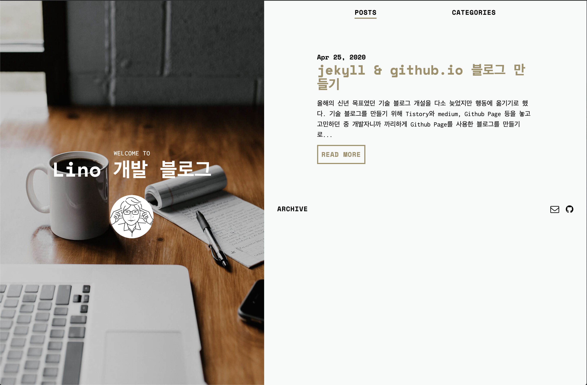

휴직을 하는 기간이 길어지며 그 동안 하지 못 했던 기술 블로그 포스팅을 다시 꾸준히 하기로 마음먹었다.
사실 이전에도 한 번 의욕적으로 Jekyll을 사용해서 블로그를 개설한 적이 있었으나 바쁘다는 핑계와 의지력의 문제로 포스팅을 오래 지속하지 못하고 유령 블로그가 되버리곤 했다.

 

> 이전에 Jekyll로 만들었던 블로그.. 유령 블로그가 되어버렸다...

 

저번에 Jekyll 블로그를 구축해보며 느낀 점은 Jekyll은 나온 지도 오래 되었고 루비로 되어있는 프로젝트 구조가 눈에 익지 않는다는 단점이 있었다. 그래서 그 당시에도 눈여겨보던 Gatsby로 블로그를 구축하고 Netlify를 사용해 정적 배포를 해보게 되었다. 블로그를 구축하며 테마 및 설정 등에 대한 참고는 하단에 링크를 통해 정리했다. 블로그 테마는 한재엽 (JBee) 님의 [Gatsby-starter-bee](https://github.com/JaeYeopHan/gatsby-starter-bee) 가 굉장히 깔끔하며 다양한 기능과 친절한 문서로 정리가 되어 있어서 이것을 채택했다.

 

### Netlify

> The fastest way to build the fastest sites.

[Netlify](https://www.netlify.com)의 핵심 카피이다. 일전에 Jekyll로 블로그를 만들었을 때에는 Github.io 를 통한 정적 페이지 배포를 하였으나, Gatsby를 사용해 만든 블로그는 Netlify로 가볍게 배포가 가능하다. 심지어 Netlify를 통해 **정적 호스팅을 할 Github Repo를 연동해 두면, Git에 push하는 것만으로도 자동으로 배포가 이루어진다**는 편한 점도 있다. 그 외에도 다음과 같은 편리한 장점들을 느꼈다.

+ SSL 무료 발급을 통한 HTTPS 이용 가능
+ 편리한 DNS 변경
+ CI에 대해 신경 쓸 필요가 없음
+ 다양한 템플릿 (Theme) 제공

  

### 좋았던 점

아무래도 Gatsby를 통해 기존에 사용해보지 못했던 GraphQL등의 문법에 대해서도 확인해 볼 수 있었고 깔끔한 보일러플레이트인 Gatsby 테마를 통해 보다 더 식견을 넓히게 되는 계기가 된 것 같다.

  

### 아쉬운 점

아직 utterance나 BMC, GA 등의 블로그 테마에 내장되어 있는 서드파티 기능들을 제대로 활성화 시키지 못한 상태이다. 문서를 좀 더 읽고 차근차근 진행할까 싶다.
또 프로필 페이지를 이전 블로그에서 마이그레이션 해 오지 못했다는 점이 있다. 이번에 블로그를 새롭게 쓰는 것을 계기로 새롭게 Md으로 작성해볼까 싶기도 하다.
