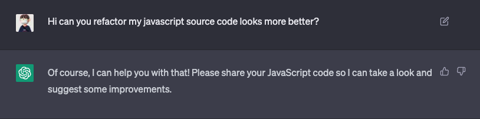

오늘은 나온 지 몇 달 되었지만 아직까지도 핫한 ChatGPT를 개발자가 어떻게 사용해 볼 수 있는지 포스팅 해보려 한다.

ChatGPT가 무엇인지에 대해서나 이용 방법에 대해서는 다른 곳에 친절하고 자세히 설명된 곳들이 많아 오늘은 개발자가 어떻게 활용하는지에 대해서만 중점적으로 다룬다.

<br>

## 간단한 코딩 요청

이미 여러 블로그 등에서 다루었지만, ChatGPT 에게는 간단한 코딩을 요청할 수 있다.

업무 중에 나는 `${HOST}?url=${URL}&total=3&curr=1` 같은 형태의 URL 문자열을 받아와서 Query-string만 따로 뽑아내 객체의 형태로 담을 필요성이 있었다.

[query-string](https://www.npmjs.com/package/query-string) 등의 라이브러리를 이용하면 편하게 값을 받아올 수 있지만, 웹뷰 내부의 도메인을 핸들링하는 특수성이 있어 모듈을 사용하기 어려웠고,

단순한 기능이였기 때문에 나는 아래와 같이 코드를 구현했었다.

```
const DOWNLOAD_URL_TAG = 'download?';

export const downloadURLParser = (downloadURL) => {
  let split = downloadURL.split(DOWNLOAD_URL_TAG);
  let params = split[1].split("&");
  return params.reduce((accumulator, item) => {
    let split = item.split("=");
    return { ...accumulator, [split[0]]: split[1] };
  }, {});
};
```
> 내가 작성했던 코드

그러다가 문득 ChatGPT에게 요구사항만으로 기능을 뽑아낼 수 있는지 확인하고 싶어져 위 함수를 만들어 달라고 요청했다.


> ChatGPT에게 함수 요구사항을 전달


> ChatGPT의 답변

위와 같이 비즈니스 로직이 크게 얽혀 있지 않고 간단하게 동작하는 코드를 짜야할 때에는 
ChatGPT에게 물어보면 사람이 직접 코딩하는 시간을 획기적으로 줄일 수 있다.

## 내가 작성한 코드 리팩토링


> ChatGPT에게 코드 리팩토링이 가능한 지 물어보는 모습 (출처 ChatGPT)

ChatGPT 에게 큰 기대 없이 던진 질문이였는데 놀랍게도 ChatGPT는 코드 리팩토링이 가능하다고 아주 자신있게 대답했다.


> Refactoring 을 받기 전의 코드

우선 리팩토링을 받기 전의 코드를 ChatGPT 채팅 프롬프트에 그대로 첨부했다.

내가 올린 코드는 imageURL에 확장자를 달아주고 React Native에서 저장소로 파일다운로드를 하며 약간의 조건문이 붙어있는 코드였다.


> ChatGPT 에 의해 리팩토링 된 코드

ChatGPT는 단순히 리팩토링 된 코드만 올리는 것이 아니라 어떤 점을 수정하면 좋은지에 대한 가이드라인까지 명확하게 제시해 주었다.

ChatGPT에 의해 수정된 코드는 완벽하게 내 환경에 적용시키기에는 다소 무리인 점도 있었으나, 참고하여 고칠 부분이 몇 가지 있어서 유용했다.


> 똑바로 수정하십시오 휴먼

<br>

## 좀 더 상세한 부분에서의 호기심 해결까지 가능하다


ChatGPT가 위의 Refactoring 부분에서 값을 재할당하지 않는 변수는 `const`로 선언하라고 코드를 정정해 주었다.

나는 `const`의 목적에 대해서는 알지만 사용했을 때의 이점이 무엇이 있는지 물었고 원래는 책이나 문서, 다른 사람들의 블로그 등을 열심히 찾아야 알 수 있는
정보들에 대해서 막힘없이 설명을 해 주었다.

단순히 코딩에서 시간을 줄일 수 있는 것이 아니라, 어째서 이게 그렇게 되는지에 대한 호기심을 충족할 때에도 ChatGPT를 통해 물어보면 조금 더 빠르게 해답을 얻을 수 있을 것으로 생각되었다.

다만 아직까지는 ChatGPT는 완전한 답변만을 내놓는다고 확신할 수가 없고, 그럼에도 불구하고 굉장히 자신있는 말투로 답변을 하기 때문에 질문을 했을 때 현명하게 정보를 골라내어야 한다.


> 한국어로 요청하면 한국어로 말해준다.

<br>

## 결정장애 등이 왔을 때 선택에도 도움을 준다 

그렇지 않아도 새 개인 사이드 프로젝트를 진행하려고 했는데, module bundler로 `Webpack`만을 사용했었기에 이번에는 새로운 module bundler를 사용해볼까 싶어
한창 리서치를 해보고 있었다.


Npm Trends를 통해 여러 라이브러리들을 비교해 보았을 때에는 사용량이나 Star 수만 가지고서는 명확한 장단점을 판단하기가 어려웠다.
어떤 상황에서 무엇이 더 좋은지에 대한 감이 잘 잡히지도 않았고, 모든 라이브러리들의 홍보 문구는 자기들은 빠르다는 것을 강조했다.
더 자세한 비교를 위해 모든 라이브러리들의 공식문서를 정독할 시간이 내게는 없었다.


ChatGPT에게 나의 상황을 설명하고 추천을 요구했을 때, 비교적 선택지를 추릴 수 있게 도와주는 답변을 해주었다.

개발자들은 이렇게 간혹 어떤 라이브러리, 툴, 프레임워크를 쓸지에 대한 고민을 하게 된다. 단순히 라이브러리나 툴, 프레임워크 뿐만 아니라
비슷한 기능을 하는 문법이라던지, 언어라던지, 플랫폼까지도 매 순간 선택을 해야할 때가 있는데 이렇게 설명을 통해 좀 더 명확하게 선택지를 추릴 수 있게 도와주는 
것 만으로 많은 도움이 되는 것 같다.

<br>

## 그러나 항상 믿을 수는 없다.

ChatGPT는 위에도 언급했듯이 정답만을 얘기하지 않는 주제에 굉장히 당당하다.

프로덕션에서 해결을 못하고 있던 문제가 있어서 큰 기대 없이 ChatGPT에게 물어보았다.


순간 답변을 좔좔 적어대는 ChatGPT를 보며 며칠 동안 해결하지 못했던 문제를 해결할 수 있게 되는건가 싶어 눈이 휘둥그레 졌었는데,

문제는 ChatGPT가 해법이랍시고 적은 소스 상의 npm module은 존재하지 않는 모듈이였다는 것이다.


> ????


굉장히 당당하게 틀린 소리를 할 때도 있기 때문에 아예 지식이 없는 상태에서 질문을 해서 정보를 얻는 것은 굉장히 위험할 수도 있다.


<br>

## 나의 사용 후기

개인적으로 느낀 장단점이 꽤 명확하게 존재하는 것 같다.

### 장점

- 비즈니스 로직이 포함되지 않은, 단순한 기능적인 코딩을 부탁할 때 시간을 단축할 수 있다.
- 작성한지 오래되었는데 주석이 없거나, 내가 작성하지 않은 남의 코드를 분석해야 할 때 분석 요청을 할 수 있다.
- 주석이나 문서화 등을 대신 부탁할 수도 있다.
- 개발에 있어 현재 상황에 알맞는 추천을 받을 수 있다.
- 정규식처럼 자주 사용하진 않지만 꼭 필요한 때가 있는, 그런 코드를 부탁할 때 편리하다.

### 단점

- 수많은 오픈소스를 긁어온 것을 토대로 답변하기 때문에 부정확한 답변이 달릴 수 있다.
- 마찬가지로 수많은 오픈소스의 코드를 긁어서 학습하기 때문에 저작권 이슈가 있다.

<br>

결국 ChatGPT도 하나의 툴이고 현재 여러 기업들에서도 ChatGPT를 자사의 서비스에 포함시키고 있는 것이 추세이다.
툴을 어떻게 사용하느냐에 따라 편의성을 많이 얻을 수 있을 것으로 보이는데 나는 아마 자주 사용하다가 많이 매력적이라면 유료 플랜으로 결제해서
이용할 의향도 있다.
