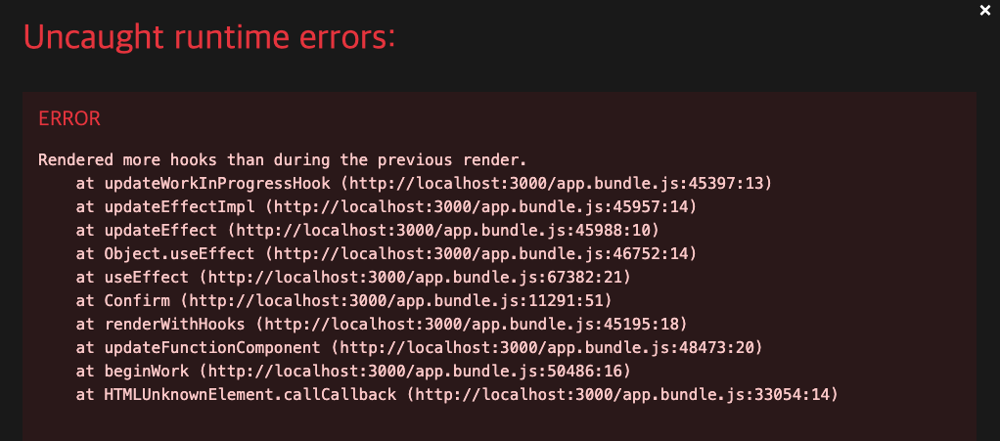
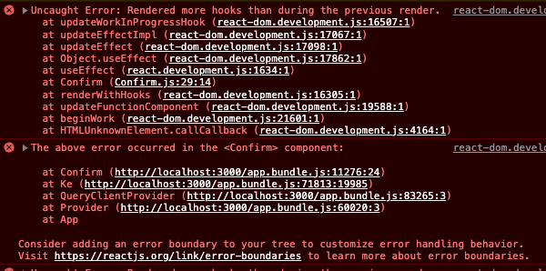
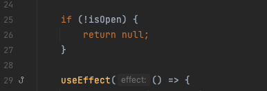

모달 형태의 Confirm component를 생성 후 redux-toolkit을 통해 전역 상태관리를 하여 comfirm을 open 하는데 에러가 발생했다.

좀 더 자세히 보기 위해 콘솔창을 보니 Confirm 컴포넌트에서 발생했다고 나와 있다.

문제는 내가 isOpen 상태가 아니면 return null; 로 render 처리를 했는데 그 밑에 react 의 hook을 사용했기 때문.

검색을 하다 참고한 블로그(하단에 링크 참조) 에서는 React에서 return을 통해 페이지를 렌더링하는데
렌더링 하는 과정 이후에 페이지에 영향을 줄 수 있는 상태를 선언했기 때문이라고 한다.

return 문을 하단으로 옮겨줌으로써 해결했다.

참고한 블로그 https://velog.io/@sinf/Rendered-more-hooks-than-during-the-previous-render
