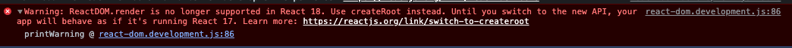

react로 프로젝트를 생성하던 중 세팅을 다 마치고 localhost 에서 돌렸을 때 다음과 같은 에러가 콘솔에 나타났다.



원래 예전에는 index.js 에서

```javascript
import ReactDOM from "react-dom";

ReactDOM.render(<App/>, document.getElementById("root"));
```

이런식으로 처리했었는데 react 18버전 이후로는 더 이상 지원하지 않는단다.
ReactDOM.render의 코드가 있으면 버전 17로 간주하고 실행된다는 경고문.

공식문서에서 추천하는 것과 같이 다음과 같이 바꾸어 주었다.

```javascript
import { createRoot } from "react-dom/client";

const container = document.getElementById("root");
const root = createRoot(container);
root.render(<App />);
```


[출처: 리액트 공식문서](https://react.dev/blog/2022/03/08/react-18-upgrade-guide#updates-to-client-rendering-apis)
