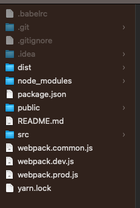
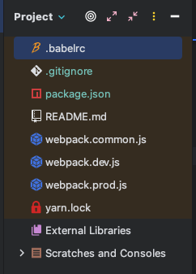
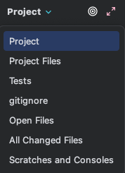
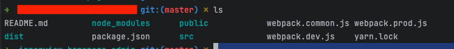
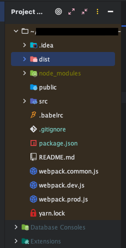
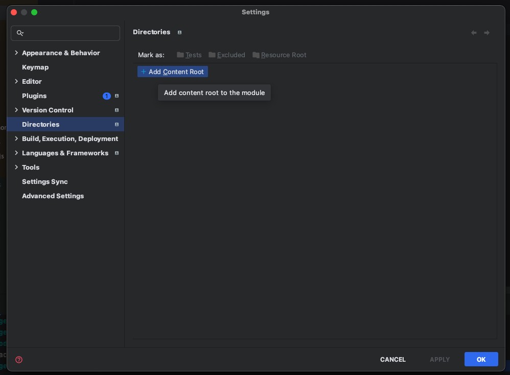
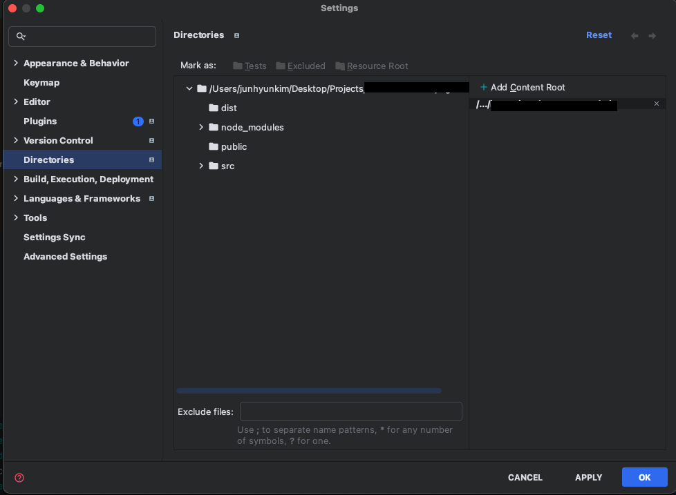
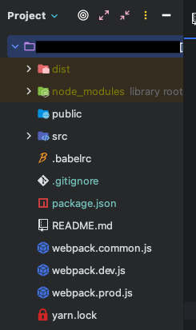

vscode에서는 겪어보지 못한 일이지만 webstorm을 사용하다가 발생한 문제가 있어서 공유하기 위해 포스팅한다.

## Trouble

며칠 전 webstorm을 사용하여 boilerplate 목적의 프로젝트를 하나 구성했다. folder structure 를 다잡고 해당 프로젝트는 Git에 업로드 한 뒤,
그 프로젝트의 폴더명과 이름 등을 바꾸어서 git remote를 변경해주고 boiler plate처럼 사용을 하려고 하는데 webstorm에서 프로젝트를 다시 켜보니
아래 이미지처럼 프로젝트 내의 폴더가 아예 보이지 않는 문제가 있었다.

> 원래 프로젝트 내에 존재하는 폴더 구조 

> Webstorm project view를 통해 확인한 내 폴더 구조

> 내 dist, node_modules, public, src 어디감????????

Finder에서 봤을 때는 아무리 봐도 폴더들이 존재하는데, webstorm의 Project view에서 확인할 때는 폴더들이 안 보이고 파일만 보이는 현상이 발생했다.

참고로 Project view란 이것을 말한다.

 

## Trouble shooting

처음에는 터미널에서 `ls`를 command 명령어를 입력해서 폴더들이 실제로 제대로 잡히는지를 확인했다.

> 잘 나오고 있는 상태

> Finder 에서도 잘나와, ls 커맨드에서도 잘나와... Webstorm UI에 문제가 있다... 이게 내 결론이다.

실제 폴더에는 문제가 없고 webstorm의 버그일거라고 판단을 하고 Project view에서 Project files view로 뷰를 변경해보았다.

프로젝트 파일 뷰로 봤을 때에는 폴더들이 잘 표시가 되었다.
여기서 끝??? 이라고 하면 뭐 속편하고 좋겠으나 계속 이 프로젝트만 Project view 대신 Project files view로 보고 싶지도 않았고,
캡쳐는 하지 못했으나 Project files view로 놓은 상태에서 Project view에 잡히지 않던 디렉토리 내의 파일에서 작업을 하려고 코드를 입력하는 순간
Project 내에 추가되어 있지 않은 파일이라는 경고문이 떴었다.

결국 근본적으로 무언가 수정은 해야하는 상태였기에 구글 검색을 하다가 다음의 시도들이 있었다.

### 시도 1 - .idea 폴더 삭제 (remove .idea folder)

[intellij jetbrain community 글 중..](https://intellij-support.jetbrains.com/hc/en-us/community/posts/207066915-Project-view-not-showing-directories)

검색하여 해결을 시도하려던 중 위 링크의 글을 발견하게 되었고, `.idea` 폴더를 삭제하고 해결되었다는 사람들이 많아서 똑같이 실행에 옮겼다.
`.idea` 폴더는 intellij 계열의 IDE를 사용할 때 IDE의 옵션, 설정 등이 저장되는 곳으로 vscode의 `.vscode` 와도 같은 역할을 한다.
다만 IDE의 설정값 뿐만 아니라 실행로그나 폴더의 구조 등에 대한 xml iml등도 함께 저장되기 때문에 그 값이 남아 있어서 Project view에 잡히지 않고 있었던 것 같았다.
`.idea` 폴더는 숨김폴더로 OS에 따라 숨김폴더를 볼 수 있도록 설정한 뒤 삭제해주면 된다.

위 방법으로 해결이 되었다는 사람들도 많았다만 나는 해당 방법으로 webstorm을 완전히 종료하고 다시 켜봐도 해결되지가 않았다.

 

### 시도 2 - Content root 추가 (add content root)

이번에는 다른 글을 발견했는데 Content root에 프로젝트의 루트 디렉토리를 추가해주면 된다는 글이였다.

일단 webstorm의 `setting` (preference) 를 열어준다.

그러면 왼쪽에 Directories 라는 항목이 있는데 `+ Add Content Root` 라는 버튼을 눌러서 현재 프로젝트의 루트 디렉토리를 추가해준다.

다음과 같이 루트 디렉토리를 추가해 주고 나니 정상적으로 Project view에서 아래와 같이 인식되지 않던 폴더들이 보이기 시작했다.

 

## 마치며

이번 포스팅을 작성할지 말지에 대해서 포스팅을 작성하면서도 계속 고민했다.

아무래도 개발 외적인 주제이기도 하고, 그렇게까지 어려운 주제를 해결한 것도 아니였기 때문이다.

그러나 `트러블슈팅` 이라는 것은 꼭 개발을 진행하면서 생긴 이슈에 대한 해결이 아니더라도, 문제가 생겼을 때 내가 어떻게 접근했는지와
어떤 방식들의 시도가 있었는지, 이 문제를 해결하고 난 뒤 느낀 점 등에 대해 정리를 하고 싶어 만든 블로그 카테고리 였다.

나도 그렇지만 많은 개발자들이 문제가 생겼거나 지식이 필요할 때 Google에 검색을 한다.
그러면서 때로는 github의 issue 페이지나 오픈소스의 공식문서를 정독하기 귀찮아서 누군가가 보기 좋게 정리해놓은 블로그를 클릭하여
빠르게 정보를 습득하기도 한다.

이슈가 있을 때 문제해결법 만을 아무런 설명없이 올려놓은 포스트는 가끔 반가울 때도 있다. 시간을 크게 들이지 않고도 가이드대로
시도를 해 볼 수 있기 때문이다. 그런 의미에서 보자면 나의 트러블슈팅 포스팅은 검색을 통해 들어온 사용자에게는 마냥 친절하지는 않다.

다만 나의 고민과 다양한 시도들을 누군가와 공유할 수 있고, 더불어 내가 오랜 시간이 지나 같은 상황에 처했을 때 다시금
시간낭비를 하지 않기 위한 이정표로 남길 수 있기에 Trouble shooting이 의미가 있는 것 같다.
